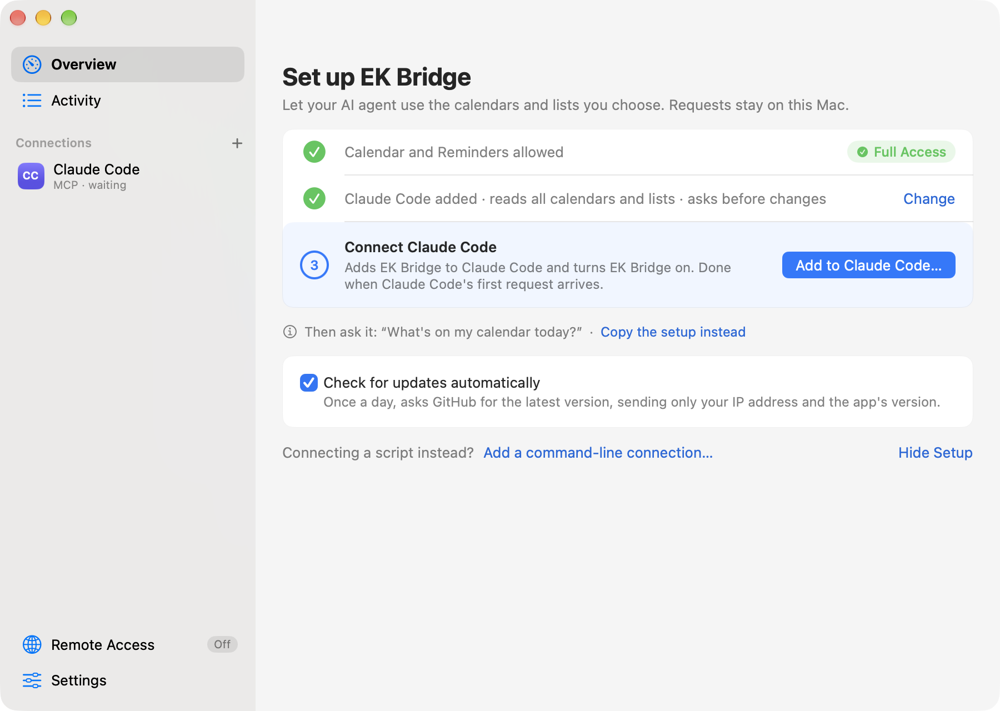
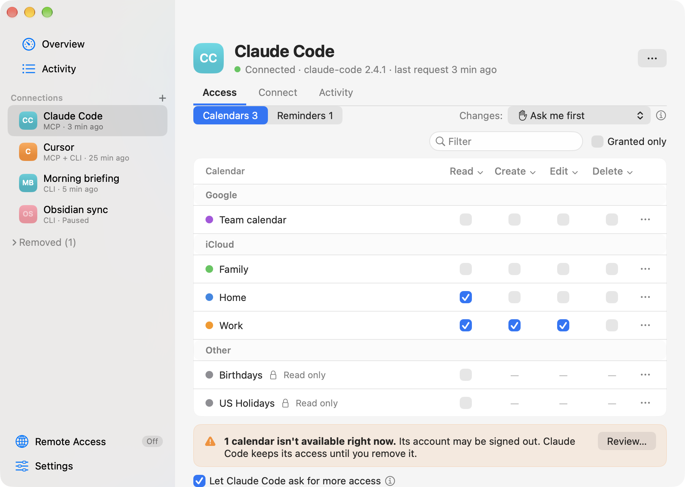
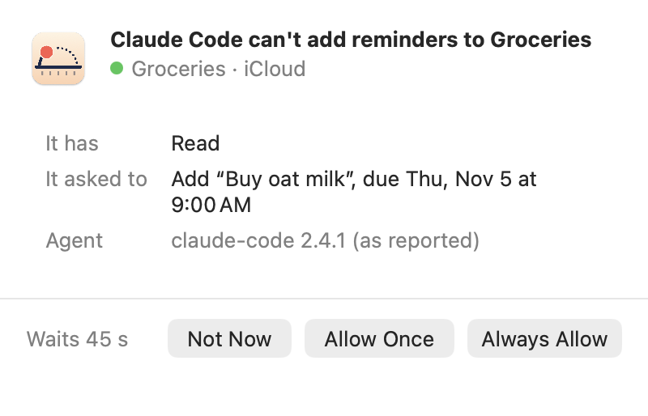
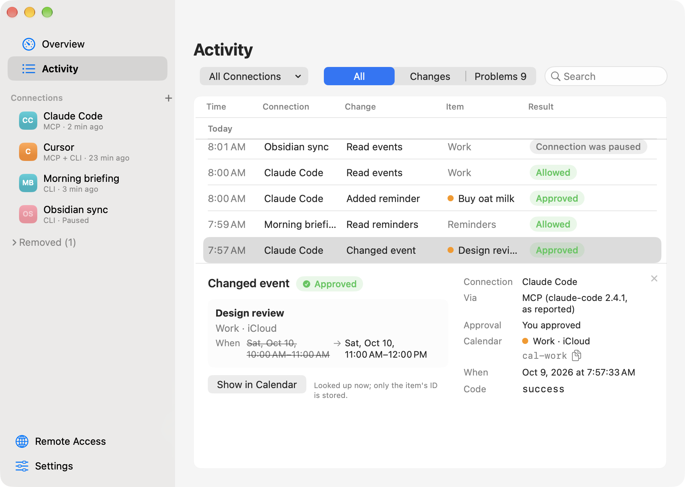

<p align="center">
  
</p>
<h1 align="center">EK Bridge</h1>
<p align="center"><b>Give AI agents your calendar. Not all of it.</b><br>
A free, open-source Mac menu bar app that lets Claude, ChatGPT, Cursor and your scripts use only the calendars and reminder lists you choose, and asks you before they change anything.</p>

<p align="center">
  <a href="https://github.com/bereciartua/ek-bridge/releases/latest"></a>
  
  
  <a href="LICENSE"></a>
  <a href="https://registry.modelcontextprotocol.io/v0/servers?search=ek-bridge"></a>
  <a href="https://mcpservers.org/servers/bereciartua/ek-bridge"></a>
</p>

<p align="center">
  <a href="https://github.com/bereciartua/ek-bridge/releases/latest/download/EKBridge.dmg"><b>Download for Mac</b></a> ·
  <a href="#get-started">Get started</a> ·
  <a href="docs/MCP.md">Agent setups</a> ·
  <a href="CHANGELOG.md">Changelog</a>
</p>

<p align="center">
<picture>
  <source media="(prefers-color-scheme: dark)" srcset="docs/images/overview-dark.png">
  
</picture>
</p>

- **Choose what each agent can touch.** Pick the calendars and reminder lists each agent may use, and whether it may read, create, edit, delete or complete. A new agent starts with nothing.
- **Approve every change.** A panel shows exactly what an agent wants to write. Nothing changes until you click Allow.
- **See everything, switch it off in one click.** Activity names what each agent changed and explains every refusal. Pause or remove an agent, or pause all of EK Bridge from the menu bar.

**Works with** Claude Code, Claude Desktop, Codex and Cursor ([tested live](docs/TESTING.md#live-mcp-matrix)), and any other MCP client, with ready-made setups for VS Code (Copilot), Gemini CLI, Zed, Cline, JetBrains AI Assistant and Devin Desktop. claude.ai and ChatGPT can connect through [Remote Access](#from-cloud-agents-experimental), which is experimental.

## What you can ask

Once an agent is connected, ask in plain words. It can act only inside the calendars and lists you gave it.

| You ask | The agent uses |
| --- | --- |
| "What's on my Work calendar this week, and where are my free hours?" | `read_events` |
| "Move Thursday's design review to Friday at 3, same length." | `read_events`, then `update_event` (which asks you first) |
| "Remind me to renew my passport next Monday at 9." | `create_reminder` in the list you granted |
| "Block 9:30–10:30 every weekday for focus time." | `create_event` with a repeat rule |

Twelve tools cover events and reminders, with every field Calendar supports: time zones, repeats, alerts, locations, notes and links. Each agent sees only the tools its access allows. The [MCP guide](docs/MCP.md#tools) has the full reference.

## Get started

1. **Install.** Download [`EKBridge.dmg`](https://github.com/bereciartua/ek-bridge/releases/latest/download/EKBridge.dmg), open it and drag EK Bridge to **Applications**. If you open it from the disk image or Downloads instead, it offers to move itself there. Or use [Homebrew](https://brew.sh):

   ```sh
   brew install --cask bereciartua/tap/ek-bridge
   ```

2. **Open the app.** It opens on a setup with three steps; later, you'll find it in the menu bar.
   1. **Allow access to Calendar and Reminders.** You need only the one your agent uses; skip the other.
   2. **Add your agent.** Pick its tile (agents found on your Mac come first) and what it can read to start with, such as **Read all calendars and lists**. Grant Read only where the agent needs it: what it reads goes to its AI provider.
   3. **Connect it.** **Add to Claude Desktop…** (or Cursor, or Claude Code) shows the exact change to the agent's settings, keeps a backup and never writes the token; it also turns EK Bridge on. For other agents, copy the command or config from the connection's **Connect** tab. The step is done when the agent's first request arrives.

<picture>
  <source media="(prefers-color-scheme: dark)" srcset="docs/images/setup-dark.png">
  
</picture>

That's it: ask your agent one of the questions above. Setups for every agent and troubleshooting are in the [MCP guide](docs/MCP.md).

EK Bridge needs **macOS 14 or later**, on Apple silicon or Intel. It's notarized by Apple and keeps itself up to date (you click to install each update). Release notes and checksums are on [Releases](https://github.com/bereciartua/ek-bridge/releases/latest). Upgrading from EventKit Bridge, its earlier name? See [Setup](docs/SETUP.md#upgrading-from-eventkit-bridge-070-or-earlier). EK Bridge is a personal project in **public preview**, with best-effort support.

## How you stay in control

EK Bridge is the only app that holds your Calendar and Reminders permission. Your agents talk to it, never to your calendars directly, and it checks every request against what you allowed.

### Each agent gets only what you tick

Every agent has its own key and its own access: Read, Create, Edit and Delete for each calendar, plus Complete for each reminder list. Share Work, keep Family to yourself.

<picture>
  <source media="(prefers-color-scheme: dark)" srcset="docs/images/access-dark.png">
  
</picture>

### You approve each change

By default, before an agent writes anything, a small panel shows every field it wants to set. Click **Allow** or **Deny**, or let one agent work for 15 minutes. A request you don't answer is refused after 45 seconds. For a script you trust, you can turn asking off.

<picture>
  <source media="(prefers-color-scheme: dark)" srcset="docs/images/approval-panel-dark.png">
  
</picture>

### It asks before it refuses

When an agent tries to add, change, complete or delete on a calendar it can read but lacks that one action, EK Bridge asks you in the same panel: *Claude Code can't add reminders to Groceries*. **Allow Once**, **Always Allow** (which saves just that action) or **Not Now**. It never asks about calendars the agent can't see, and at most once an hour for the same thing.

<picture>
  <source media="(prefers-color-scheme: dark)" srcset="docs/images/access-request-dark.png">
  
</picture>

### You can see everything, and stop anything

**Activity** says what each agent changed, by name (*Moved “Design review”*), and explains every refusal in plain words. EK Bridge stores only the item's ID and looks the name up when you open the row, with **Show in Calendar**. **Pause** an agent's connection to refuse its requests while keeping its setup, **Remove** it to cut it off for good, or pause all of EK Bridge from the menu bar. Optional notifications tell you when a change wasn't made because nobody answered.

<picture>
  <source media="(prefers-color-scheme: dark)" srcset="docs/images/activity-dark.png">
  
</picture>

### Under the hood

- **Local by default.** Everything is off until you turn it on. The MCP server listens only on `127.0.0.1`. No account, no analytics, no server of ours.
- **A key per agent.** Each agent has its own 256-bit token, stored only as a hash; scripts sign their requests with their own Ed25519 key.
- **Safe writes.** Edits and deletes need the latest version of an item. Every written field is read back, and a mismatch is rolled back.
- **Cloud only through your tunnel.** A cloud agent can reach EK Bridge only through Remote Access and a tunnel you run, for agents you allowed, and never while your Mac is asleep, offline or logged out.
- **Signed updates.** Updates come from GitHub, signed by the developer and checked before they install.
- **Open source.** Read the code, the [threat model](docs/ARCHITECTURE.md) and the [test record](docs/TESTING.md).

**What it doesn't protect against:** another program running as your macOS user can read the same key files. Access settings separate the agents you connect; they aren't a defense against malware already on your Mac. Details are in [Security boundary](#security-boundary).

## FAQ

<details>
<summary><b>Is it free?</b></summary>

Yes. EK Bridge is open source under the Apache License 2.0, with no account or trial.
</details>

<details>
<summary><b>Does my calendar data leave my Mac?</b></summary>

EK Bridge itself sends nothing anywhere; [Privacy](#privacy) lists every connection it makes. What an agent reads through it goes to that agent and its AI provider, under their terms, so grant Read only where the agent needs it.
</details>

<details>
<summary><b>Does it always ask before a change?</b></summary>

For AI agents, yes by default. You can turn asking off per connection, for example for a script you trust, or allow one agent's changes for 15 minutes at a time. See [Ask before changes](docs/MCP.md#ask-before-changes).
</details>

<details>
<summary><b>Which calendars work?</b></summary>

The accounts that appear in the Calendar and Reminders apps, such as iCloud, Google, Exchange, CalDAV and On My Mac. The live tests so far ran on iCloud; see [Testing](docs/TESTING.md).
</details>

<details>
<summary><b>Can I use it with ChatGPT or claude.ai?</b></summary>

Yes, through Remote Access, which forwards cloud agents to your Mac through a tunnel you run, such as Tailscale Funnel. It's off by default and experimental, and your Mac has to be awake and online. See [From cloud agents](#from-cloud-agents-experimental).
</details>

<details>
<summary><b>Can my own scripts use it?</b></summary>

Yes, with the `bridge-client` command-line tool. Each script gets its own key and its own access, like an agent. See [From scripts](#from-scripts).
</details>

<details>
<summary><b>How is this different from other Mac MCP servers?</b></summary>

Most give agents broad access to many apps, with one switch per app or service. EK Bridge does only Calendar and Reminders, but per calendar, per agent, with approvals, an activity log and revocation. If you trust an agent with everything, you may not need it.
</details>

<details>
<summary><b>Is it made by Apple?</b></summary>

No. EK Bridge is an independent open-source project built on Apple's public EventKit framework. It isn't affiliated with or endorsed by Apple.
</details>

Something else? Ask in [Discussions](https://github.com/bereciartua/ek-bridge/discussions/categories/q-a).

## More ways to connect

### From scripts

Scripts and tools without MCP use `bridge-client`, which signs each request with the connection's own key.

1. Add a connection with **Connects from ▸ Command line**, choose its access and **Save**.
2. Install the tool from **Settings ▸ Advanced ▸ Install Command-Line Tool**. It links `bridge-client` into `~/.local/bin`; if your shell can't find it, add that folder to your `PATH`. (Homebrew already linked it into its own `bin`.)
3. Send a test request. The connection's page has it ready to copy:

   ```sh
   bridge-client scope_status --client "Morning briefing"
   ```

Until the tool is installed, the copied command uses the app's full path, `/Applications/EKBridge.app/Contents/MacOS/bridge-client`, so it works as pasted. `bridge-client --help` lists every command and the access it needs. Errors say what's wrong and how to fix it, with a distinct exit code for each kind of problem. See [A safe first CLI check](docs/USAGE.md#a-safe-first-cli-check) and the [API and CLI reference](docs/API.md).

### From cloud agents (experimental)

Cloud agents run on their vendor's servers and can't reach `127.0.0.1`. **Remote Access** (its own page in the sidebar, with a guided setup; off by default) opens a second loopback port, 47616, for a tunnel you run, such as Tailscale Funnel; the app shows the commands and tests the result. Each connection also needs **Allow cloud access**.

- Agents that send a header (the Anthropic and OpenAI APIs, Claude Code on the web, Cursor and Copilot cloud agents, Devin) use the connection's separate remote token.
- claude.ai, ChatGPT and Gemini Enterprise sign in with OAuth, which you approve on the Mac by matching a six-digit code.

Remote Access has offline tests, but hasn't yet been tested live with every cloud agent and tunnel. Turn it on only while you need it, and keep its URL private; its path is the secret. See [Use from cloud agents](docs/MCP.md#use-from-cloud-agents).

## Guides

| Goal | Guide |
| --- | --- |
| Install, build from source, signing and macOS access | [Setup](docs/SETUP.md) |
| Add a connection and use the app | [User guide](docs/USAGE.md) |
| Connect an AI agent over MCP, or a cloud agent through Remote Access; tool reference | [MCP guide](docs/MCP.md) |
| Call the CLI and understand command parameters | [API and CLI reference](docs/API.md) |
| Understand processes, file storage, and security limits | [Architecture and threat model](docs/ARCHITECTURE.md) |
| See what was tested and diagnose failures | [Testing and troubleshooting](docs/TESTING.md) |
| Contribute, or maintain and release | [Contributing](CONTRIBUTING.md), [Maintaining](docs/MAINTAINING.md) |

## Privacy

The app has **no analytics, telemetry or crash reporting**, and no account. Your calendars, reminders, connections and Activity stay on your Mac. These are every network connection it makes:

| Connection | When |
| --- | --- |
| MCP server, listening on `127.0.0.1:47615` | Only while EK Bridge is on and a connection has MCP access (Settings ▸ Advanced ▸ Local MCP server turns it off). Loopback only: other computers can't connect. |
| Remote Access, listening on `127.0.0.1:47616` | Only while **Remote Access** is on (off by default). Loopback only; a tunnel you run forwards cloud agents to it. |
| One HTTPS request to your Remote Access address | Only when the Remote Access guide tests the tunnel, or you click **Test** on the Remote Access page. |
| One HTTPS request for a cloud agent's client metadata | Only while you pair an OAuth cloud agent (claude.ai, ChatGPT), to the address that agent gives. Private and local addresses are refused. |
| `bridge-mcp` connecting to `127.0.0.1` | When an agent on your Mac starts it, to reach the MCP server. |
| One HTTPS request to GitHub for `appcast.xml`, the list of the latest version | Once a day while **Settings ▸ General ▸ Check for updates automatically** is on (on in downloaded copies; a copy built from source never checks), and when you choose **Check for Updates…**. GitHub sees your IP address and the app's version; nothing else is sent. |
| Downloading an update from GitHub | Only after you click **Install Update** in the update window. The app checks the download's EdDSA signature and that it's signed by the same developer before installing it. |

On disk, besides connections and Activity, EK Bridge keeps the names, accounts and colours of the calendars and lists you've given access to (`collection-labels.json`), so it can still name one that becomes unavailable. Activity keeps an item's EventKit ID for each change (not its title), and looks the item up when you open the row; EK Bridge never stores item titles or contents.

**Notifications** are shown by macOS. One about a change that wasn't made can include the item's title, which macOS may show on the lock screen depending on your settings; turn each kind on or off in **Settings ▸ General ▸ Notifications**.

What an agent reads through EK Bridge goes to that agent and its AI provider, under their privacy terms, so grant only what each agent needs. Tunnels other than Tailscale Funnel can read Remote Access traffic at their edge.

## Security boundary

- **Script keys.** EK Bridge stores each command-line connection's Ed25519 signing credential in a mode-0600 file under your Application Support directory; the registry stores only a public verifier and the grants.
- **MCP server.** Runs only while EK Bridge is on and a connection has MCP access. It listens only on `127.0.0.1:47615`, never on a network interface. Every request needs the connection's own 256-bit token, kept in a mode-0600 file; the registry stores only its SHA-256 hash, and the recommended agent setups read the file instead of putting the token in the agent's config. Requests with a foreign `Host`, any `Origin` (web pages), or tunnel forwarding headers are refused, and repeated failed sign-ins are locked out. See the [threat review](docs/ARCHITECTURE.md#mcp-threat-review-040).
- **Remote Access.** Also off by default. While on, it listens on `127.0.0.1:47616` for a tunnel you run; every path except a 128-bit secret path gets 404, and only connections with **Allow cloud access** can use it, with a separate remote token or an OAuth connection you approved on the Mac. Local tokens don't work through it, and its credentials don't work on the local port. See the [Remote Access threat review](docs/ARCHITECTURE.md#remote-access-threat-review-050).
- **Request files** are owned by you and have restricted permissions.

**These controls do not isolate another process running as the same macOS user.** Such a process can access the credential, token or policy files. A grant is therefore a boundary between the connections in this app's protocol, not a defense against a compromised user account.

Report vulnerabilities privately, as described in [SECURITY.md](SECURITY.md).

## What works today

The short version is above. The complete list, with what EventKit doesn't allow:

<details>
<summary><b>Show the full list</b></summary>

- The user chooses collections and Read, Create, Edit, Delete, or reminder Complete grants per connection. New connections have zero grants. Saved grants persist until edited or the connection is removed; EK Bridge itself is off until turned on locally. A connection can be paused, which refuses its requests but keeps its credentials and access, and resumed later.
- AI agents on the Mac use twelve MCP tools (`list_collections`, `read_events`, `get_event`, `create_event`, `update_event`, `delete_event`, `read_reminders`, `get_reminder`, `create_reminder`, `update_reminder`, `complete_reminder`, `delete_reminder`) with ISO 8601 times. Each agent sees only the tools its grants allow. **Ask before changes** can require your approval for every write, per connection, and shows every field that would change.
- Reads return bounded event or reminder rows, not unrestricted access to the user's EventKit store. Reads of other collections are denied. Writes use an idempotency key; edits and deletes require the latest item version.
- Events support every field EventKit exposes: times saved in the time zone you choose (or the Mac's, never UTC by default), all-day events up to a year, notes, location with a map pin, URL, alarms (including arriving or leaving a place), availability, and repeat rules. Recurring events can be changed or deleted one occurrence at a time, from one occurrence on, or as a whole series. Attendees, the organizer and your response are readable; invitations stay read-only, because changing them can notify every attendee.
- Reminders support title, due and start dates, notes, URL, priority, several alarms (including location alarms), repeat rules, completing and reopening, moving between lists, and deleting a repeating reminder as a series. One occurrence of a repeating reminder can be completed for the shapes and account types a supervised probe has verified (today an iCloud daily reminder with a due time).
- Updates change only the fields they send, and every written field is read back: a mismatch removes a new item or puts an edited one back. Inviting people, answering invitations, attachments, travel time and the Reminders app's tags and subtasks aren't possible through EventKit.
- Cloud agents can use the same tools through Remote Access, a tunnel you run and a per-connection **Allow cloud access** switch, with a separate remote token per connection or OAuth connections you approve on the Mac. Remote Access is off by default, can turn itself off on a timer, and is one click to turn off from the menu bar.
- When an agent lacks one action on a calendar or list it can already read, EK Bridge asks you (Allow Once, Always Allow, Not Now) instead of refusing straight away; writes only, throttled, and switchable per connection.
- One window with Overview, Activity (what changed, by item name looked up live from its stored EventKit ID; changes and problems kept for 90 days; whether each request came via MCP, Remote Access or the command line), each connection and Settings; a menu bar icon that shows whether EK Bridge is on, paused or needs attention, with a globe while Remote Access is on; optional notifications; and a first-run checklist.
- The app can launch at login when you turn that on.

The [support matrix](docs/API.md#support-matrix) and [testing record](docs/TESTING.md) distinguish implemented behavior from provider-specific observations and untested cases.
</details>

## Build from source

You need macOS 14 or later, Xcode or the Xcode Command Line Tools, and Python 3. Building and the offline tests don't install the app or ask for access:

```sh
sh test.sh
sh build.sh
```

The build creates `build/EKBridge.app`, with the MCP launcher `bridge-mcp` and the command-line client `bridge-client` inside it (`build/bridge-client` links to it). It signs the app **ad hoc by default**, which macOS treats as a new app each time; for lasting Calendar and Reminders access, sign with a stable identity as described in [Setup](docs/SETUP.md#build-from-source).

- `EVENTKIT_ARCHS="arm64 x86_64" sh build.sh` builds a universal app.
- `sh ui_test.sh` runs the window and behavior tests, and `sh ui_snapshots.sh` writes screenshots of every screen; both use fake data.
- Releases are built by `release.sh` (Developer ID signing, notarization, a DMG and a zip), by hand or by the release workflow; see [Maintaining](docs/MAINTAINING.md#releasing).

To contribute, see [Contributing](CONTRIBUTING.md).

## Uninstall

1. Quit the app from its menu bar menu.
2. Remove its Calendar and Reminders access. The first command reads the app's bundle ID, so run these before you delete the app:

   ```sh
   bundle_id=$(defaults read /Applications/EKBridge.app/Contents/Info CFBundleIdentifier)
   tccutil reset Calendar "$bundle_id"
   tccutil reset Reminders "$bundle_id"
   ```

3. Delete the app from Applications, and its data: `~/Library/Application Support/EKBridge` (connections, keys, tokens, Activity and the write journal). If you upgraded from EventKit Bridge, also delete the `EventKitBridge` link next to it. Settings and the updater's downloads are in `~/Library/Preferences/io.github.bereciartua.ekbridge.plist` and `~/Library/Caches/io.github.bereciartua.ekbridge`.
4. If you installed the command-line tool, delete `~/.local/bin/bridge-client`.
5. Remove the server from your agents' configs (for example `claude mcp remove ek-bridge`), and stop any tunnel you ran for Remote Access.

Installed with Homebrew? Do steps 1, 2 and 5, and `brew uninstall --cask ek-bridge` removes the app and its `bridge-client` link; with `--zap` it also moves the data and settings in step 3 to the Trash.

## Project status

EK Bridge is in **public preview**, with best-effort support.

- **Tested offline:** the local bridge and UI; the MCP server, launcher, agent setups, Remote Access and its OAuth server, over real loopback sockets and a local HTTPS fixture.
- **Tested live:** bounded tests on synthetic EventKit items, a full Mac reboot and login with scoped reads still working, and a first check with Claude Code, Claude Desktop, Codex and Cursor (connect, read, an approved write, a refused request). Tested on macOS 27.0.1 on Apple silicon with iCloud.
- **Not yet run:** the full live agent matrix and the live cloud matrix. Notification and provider sync behavior isn't established for every recurrence shape.

See [testing and open checks](docs/TESTING.md) and the [changelog](CHANGELOG.md).

## License

EK Bridge is licensed under the [Apache License 2.0](LICENSE); see [NOTICE](NOTICE). The license doesn't grant rights to the project's name or icon. Apple, Mac and macOS are trademarks of Apple Inc. This project is not affiliated with or endorsed by Apple.

EK Bridge is made by [Martin Bereciartua](https://www.linkedin.com/in/bereciartua/).
