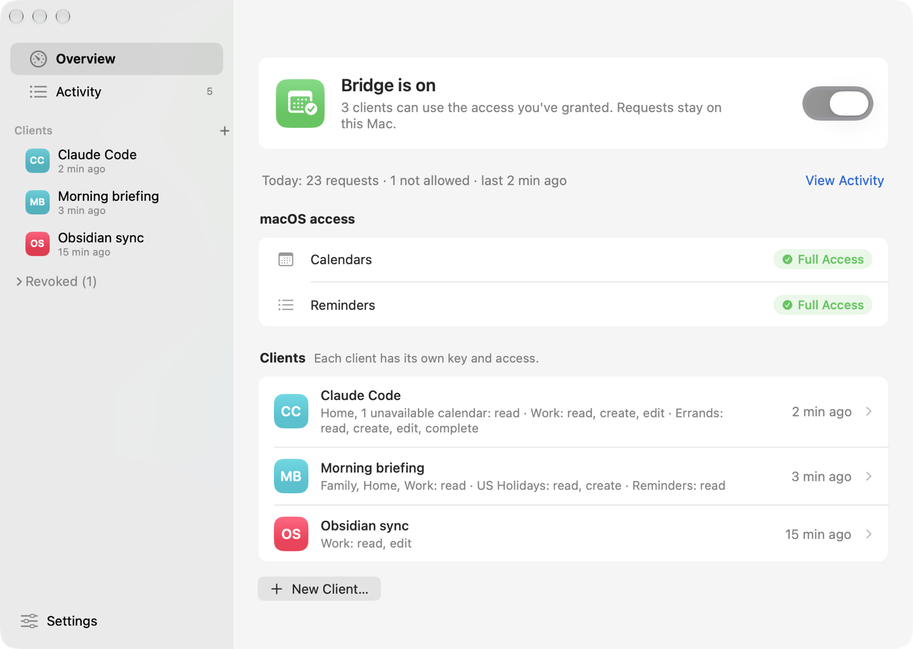
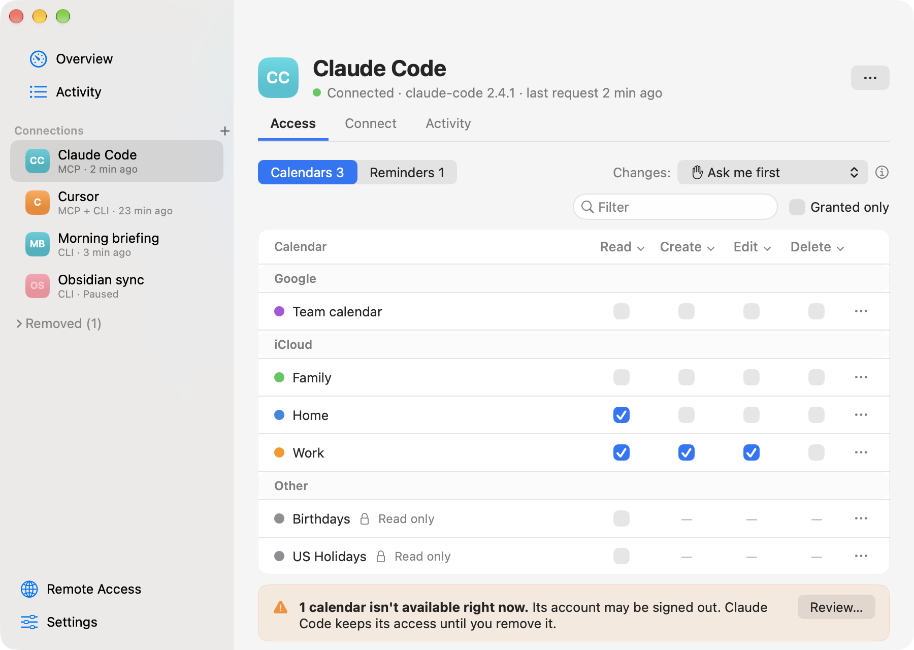
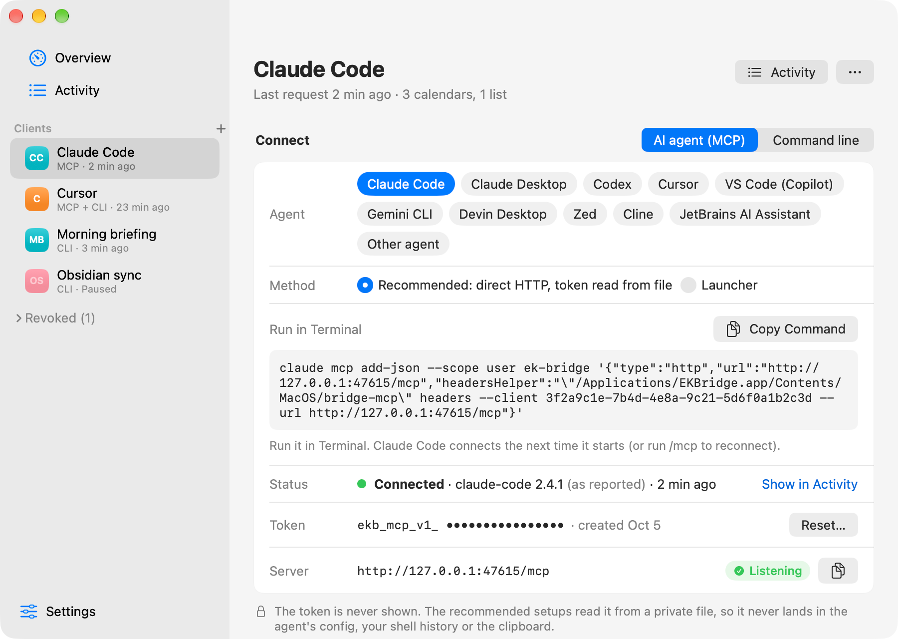
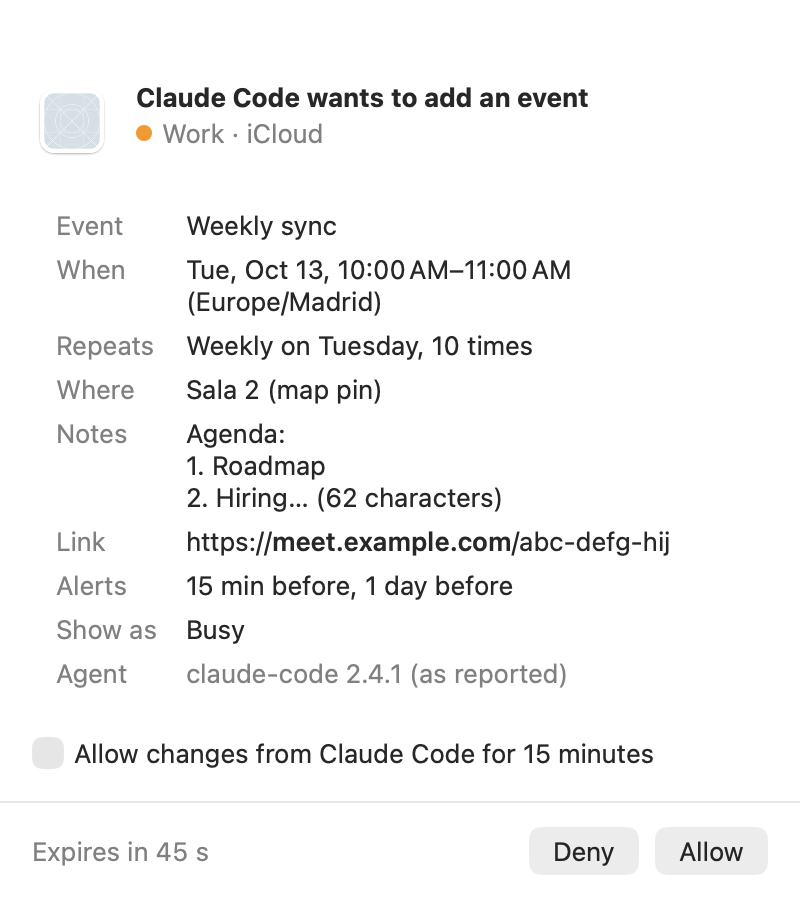

# EK Bridge

EK Bridge is a **macOS menu bar app** that gives scripts and AI agents scoped, revocable access to your Calendar and Reminders. Tools on the same Mac reach it two ways: a command-line client sends signed JSON requests through a private file exchange, and AI agents (Claude Code, Codex, Claude Desktop, Cursor and others) connect to an optional **MCP server** on `127.0.0.1`. With optional **Remote Access**, cloud agents such as claude.ai, ChatGPT and Cursor's cloud agents reach that server through a tunnel you run. Either way, the app checks macOS Full Access, the client's saved grant for a specific calendar or reminder list, request shape, and write safeguards before using Apple's EventKit framework, and can ask you before each change.

<picture>
  <source media="(prefers-color-scheme: dark)" srcset="docs/images/overview-dark.png">
  
</picture>

Everything is off until you turn it on. The only network listeners are the MCP server and Remote Access, both off by default and bound to the loopback address. A cloud agent can reach the bridge only through Remote Access and a tunnel you set up, only for clients you allowed; it can't reach a Mac that's asleep, offline or logged out.

This is a personal project in **public preview**, with best-effort support. It is not affiliated with Apple.

## Install

1. Download the latest `.dmg` from [Releases](https://github.com/bereciartua/ek-bridge/releases/latest).
2. Open it and drag the app to **Applications**.
3. Open the app. Its window opens on a setup checklist; later, use the calendar icon in the menu bar.

Or install it with [Homebrew](https://brew.sh), which also links `bridge-client` into Homebrew's `bin`:

```sh
brew install --cask bereciartua/tap/ek-bridge
```

It needs **macOS 14 or later**, on Apple silicon or Intel. Either way the app updates itself. Upgrading from EventKit Bridge, its earlier name? See [Setup](docs/SETUP.md#upgrading-from-eventkit-bridge-070-or-earlier).

For scripts, install the command-line client from **Settings ▸ Developer ▸ Install Command-Line Tool** (Homebrew already linked it). It links `bridge-client` into `~/.local/bin`; if your shell can't find it, add that folder to your `PATH`.

## Quick start

These are the same steps as the setup checklist the app shows on first launch:

1. **Open the app** (see [Install](#install)).
2. **Allow Calendar and/or Reminders access.** You need only the one your tools use.
3. **Create a client** for each tool or script, with **Connects from ▸ Command line**. It gets its own key file and starts with no access. (For an AI agent, see below.)
4. **Choose what the client can use:** which calendars and lists, and which actions (Read, Create, Edit, Delete, Complete). Then **Save**.
5. **Turn on the bridge and send a test request.** The client page has a ready-to-run command:

```sh
bridge-client scope_status --client "Claude Code"
```

From a source checkout, `python3 client.py` works the same way.



`bridge-client --help` lists every command and the access it needs. Errors say what's wrong and how to fix it, with a distinct exit code for each kind of problem ([API and CLI](docs/API.md)). The app's **Activity** pane shows every request with a plain explanation of its result.

### Connect an AI agent

After steps 1 and 2 above, the checklist follows the same path for an agent:

1. **New Client…**: name it after the agent and choose **Connects from ▸ AI agent (MCP)**. The app creates a token file for it; the client has no access, and **Ask me before each change** is on.
2. **Choose access** in the client's Access table, then **Save**. Grant Read only on what the agent needs: what it reads goes to its AI provider.
3. **Turn on the bridge and the MCP server** (Settings ▸ MCP Server, or the checklist). The server listens on `http://127.0.0.1:47615/mcp`.
4. **Copy the setup** from the client's **Connect ▸ AI agent** tab: pick your agent and paste the command or config. The status line says **Connected** when the first request arrives.

<picture>
  <source media="(prefers-color-scheme: dark)" srcset="docs/images/connect-agent-dark.png">
  
</picture>

When the agent wants to change something, a small panel asks you first. You can turn that off per client.

<picture>
  <source media="(prefers-color-scheme: dark)" srcset="docs/images/approval-panel-dark.png">
  
</picture>

Setups for every supported agent, the tool reference and troubleshooting are in the [MCP guide](docs/MCP.md).

### Connect a cloud agent (experimental)

Cloud agents run on their vendor's servers and can't reach `127.0.0.1`. **Remote Access** (Settings ▸ Remote Access, off by default) opens a second loopback port, 47616, for a tunnel you run, such as Tailscale Funnel; the app shows the commands and tests the result. Each client needs **Allow cloud access** on its page. Agents that send a header (the Anthropic and OpenAI APIs, Claude Code on the web, Cursor and Copilot cloud agents, Devin) use the client's separate remote token. claude.ai, ChatGPT and Gemini Enterprise sign in with OAuth, which you approve on the Mac by matching a six-digit code. See [Use from cloud agents](docs/MCP.md#use-from-cloud-agents).

Remote Access is **experimental**: it has offline tests, but hasn't yet been tested live with every cloud agent and tunnel. Turn it on only while you need it, and keep the Remote Access URL private; its path is the secret.

## Guides

| Goal | Guide |
| --- | --- |
| Install, build from source, signing and macOS access | [Setup](docs/SETUP.md) |
| Enroll a client and use the app | [User guide](docs/USAGE.md) |
| Connect an AI agent over MCP, or a cloud agent through Remote Access; tool reference | [MCP guide](docs/MCP.md) |
| Call the CLI and understand command parameters | [API and CLI reference](docs/API.md) |
| Understand processes, file storage, and security limits | [Architecture and threat model](docs/ARCHITECTURE.md) |
| See what was tested and diagnose failures | [Testing and troubleshooting](docs/TESTING.md) |
| Contribute, or maintain and release | [Contributing](CONTRIBUTING.md), [Maintaining](docs/MAINTAINING.md) |

## What works today

- The user chooses collections and Read, Create, Edit, Delete, or reminder Complete grants per client. New clients have zero grants. Saved grants persist until edited or revoked; the bridge itself is off until enabled locally. A client can be paused, which refuses its requests but keeps its credentials and access, and resumed later.
- AI agents on the Mac use twelve MCP tools (`list_collections`, `read_events`, `get_event`, `create_event`, `update_event`, `delete_event`, `read_reminders`, `get_reminder`, `create_reminder`, `update_reminder`, `complete_reminder`, `delete_reminder`) with ISO 8601 times. Each agent sees only the tools its grants allow. **Ask before changes** can require your approval for every write, per client, and shows every field that would change.
- Reads return bounded event or reminder rows, not unrestricted access to the user's EventKit store. Reads of other collections are denied. Writes use an idempotency key; edits and deletes require the latest item version.
- Events support every field EventKit exposes: times saved in the time zone you choose (or the Mac's, never UTC by default), all-day events up to a year, notes, location with a map pin, URL, alarms (including arriving or leaving a place), availability, and repeat rules. Recurring events can be changed or deleted one occurrence at a time, from one occurrence on, or as a whole series. Attendees, the organizer and your response are readable; invitations stay read-only, because changing them can notify every attendee.
- Reminders support title, due and start dates, notes, URL, priority, several alarms (including location alarms), repeat rules, completing and reopening, moving between lists, and deleting a repeating reminder as a series. One occurrence of a repeating reminder can be completed for the shapes and account types a supervised probe has verified (today an iCloud daily reminder with a due time).
- Updates change only the fields they send, and every written field is read back: a mismatch removes a new item or puts an edited one back. Inviting people, answering invitations, attachments, travel time and the Reminders app's tags and subtasks aren't possible through EventKit.
- Cloud agents can use the same tools through Remote Access, a tunnel you run and a per-client **Allow cloud access** switch, with a separate remote token per client or OAuth connections you approve on the Mac. Remote Access is off by default, can turn itself off on a timer, and is one click to turn off from the menu bar.
- One window with Overview, Activity (which says whether each request came via MCP, Remote Access or the command line), each client and Settings; a menu bar icon that shows whether the bridge is on, off or needs attention, with a globe while Remote Access is on; and a first-run checklist.
- The app can launch at login when you turn that on.

The [support matrix](docs/API.md#support-matrix) and [testing record](docs/TESTING.md) distinguish implemented behavior from provider-specific observations and untested cases.

## Privacy

The app has **no analytics, telemetry or crash reporting**, and no account. Your calendars, reminders, clients and Activity stay on your Mac. These are every network connection it makes:

| Connection | When |
| --- | --- |
| MCP server, listening on `127.0.0.1:47615` | Only while **Settings ▸ MCP Server** is on (off by default). Loopback only: other computers can't connect. |
| Remote Access, listening on `127.0.0.1:47616` | Only while **Settings ▸ Remote Access** is on (off by default). Loopback only; a tunnel you run forwards cloud agents to it. |
| One HTTPS request to your Remote Access address | Only when you click **Test** in Settings ▸ Remote Access. |
| One HTTPS request for a cloud agent's client metadata | Only while you pair an OAuth cloud agent (claude.ai, ChatGPT), to the address that agent gives. Private and local addresses are refused. |
| `bridge-mcp` connecting to `127.0.0.1` | When an agent on your Mac starts it, to reach the MCP server. |
| One HTTPS request to GitHub for `appcast.xml`, the list of the latest version | Once a day while **Settings ▸ General ▸ Check for updates automatically** is on (on in downloaded copies; a copy built from source never checks), and when you choose **Check for Updates…**. GitHub sees your IP address and the app's version; nothing else is sent. |
| Downloading an update from GitHub | Only after you click **Install Update** in the update window. The app checks the download's EdDSA signature and that it's signed by the same developer before installing it. |

What an agent reads through the bridge goes to that agent and its AI provider, under their privacy terms, so grant only what each agent needs. Tunnels other than Tailscale Funnel can read Remote Access traffic at their edge.

## Security boundary

The bridge stores each client's Ed25519 signing credential in a mode-0600 file under the user's Application Support directory; the registry stores a public verifier and grants.

The MCP server is **off by default**. When on, it listens only on `127.0.0.1:47615`, never on a network interface. Every request needs the client's own 256-bit token, kept in a mode-0600 file; the registry stores only its SHA-256 hash, and the recommended agent setups read the file instead of putting the token in the agent's config. Requests with a foreign `Host`, any `Origin` (web pages), or tunnel forwarding headers are refused, and repeated failed sign-ins are locked out. See the [threat review](docs/ARCHITECTURE.md#mcp-threat-review-040).

**Remote Access** is also off by default. While on, it listens on `127.0.0.1:47616` for a tunnel the user runs; every path except a 128-bit secret path gets 404, and only clients with **Allow cloud access** can use it, with a separate remote token or an OAuth connection the user approved on the Mac. Local tokens don't work through it, and its credentials don't work on the local port. See the [Remote Access threat review](docs/ARCHITECTURE.md#remote-access-threat-review-050). Request and response files are owned by the user and have restricted permissions. **These controls do not isolate another process running as the same macOS user.** Such a process can access the credential, token or policy files. A grant is therefore a boundary between enrolled clients in this app's protocol, not a defense against a compromised user account.

Report vulnerabilities privately, as described in [SECURITY.md](SECURITY.md).

## Build from source

You need macOS 14 or later, Xcode or the Xcode Command Line Tools, and Python 3. Building and the offline tests don't install the app or ask for access:

```sh
sh test.sh
sh build.sh
```

The build creates `build/EKBridge.app`, with the MCP launcher `bridge-mcp` and the command-line client `bridge-client` inside it (`build/bridge-client` links to it). It signs the app **ad hoc by default**, which macOS treats as a new app each time; for lasting Calendar and Reminders access, sign with a stable identity as described in [Setup](docs/SETUP.md#build-from-source). `EVENTKIT_ARCHS="arm64 x86_64" sh build.sh` builds a universal app. `sh ui_test.sh` runs the window and behavior tests and `sh ui_snapshots.sh` writes screenshots of every screen; both use fake data. See [Contributing](CONTRIBUTING.md). Releases are built by `release.sh` (Developer ID signing, notarization, a DMG and a zip), by hand or by the release workflow; see [Maintaining](docs/MAINTAINING.md#releasing).

## Uninstall

1. Quit the app from its menu bar menu.
2. Remove its Calendar and Reminders access. The first command reads the app's bundle ID, so run these before you delete the app:

   ```sh
   bundle_id=$(defaults read /Applications/EKBridge.app/Contents/Info CFBundleIdentifier)
   tccutil reset Calendar "$bundle_id"
   tccutil reset Reminders "$bundle_id"
   ```

3. Delete the app from Applications, and its data: `~/Library/Application Support/EKBridge` (clients, keys, tokens, Activity and the write journal). If you upgraded from EventKit Bridge, also delete the `EventKitBridge` link next to it. Settings and the updater's downloads are in `~/Library/Preferences/io.github.bereciartua.ekbridge.plist` and `~/Library/Caches/io.github.bereciartua.ekbridge`.
4. If you installed the command-line tool, delete `~/.local/bin/bridge-client`.
5. Remove the server from your agents' configs (for example `claude mcp remove ek-bridge`), and stop any tunnel you ran for Remote Access.

Installed with Homebrew? Do steps 1, 2 and 5, and `brew uninstall --cask ek-bridge` removes the app and its `bridge-client` link; with `--zap` it also moves the data and settings in step 3 to the Trash.

## Project status

Offline tests and bounded live tests have exercised the local bridge, UI, and synthetic EventKit items. The MCP server, launcher, agent setups, Remote Access and its OAuth server have offline tests over real loopback sockets and a local HTTPS fixture; neither the live agent matrix nor the live cloud matrix has been run yet. A full Mac reboot followed by login was observed with the bridge running and authorized scoped reads working. Notification and provider synchronization behavior is not established for every recurrence shape. Tested on macOS 27.0.1 on Apple silicon with iCloud. See [testing and open checks](docs/TESTING.md) and the [changelog](CHANGELOG.md).

## License

EK Bridge is licensed under the [Apache License 2.0](LICENSE); see [NOTICE](NOTICE). The license doesn't grant rights to the project's name or icon. Apple, Mac and macOS are trademarks of Apple Inc. This project is not affiliated with or endorsed by Apple.
