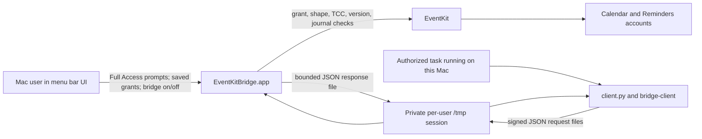

# Architecture and security boundary

## Components and data flow

The app is a menu bar process in the logged-in user's session. `BridgeAppDelegate` owns the UI, `ClientManagerUI` owns client and grant controls, `ClientRegistry` persists public verifiers and scopes, `LocalBridge` polls the local request directory, `EventKitCommands` performs authorized work, and `WriteJournal` records write identity and outcome. The matching Swift `bridge-client` is invoked by `client.py`. It reads a credential file locally and signs each request with Ed25519. A Python or shell task may call it **only if that task is executing on the Mac** with the user's authorization. There is no implemented MCP wrapper, cloud callback, HTTP server, network listener, or launchd Mach service.

`LocalBridge` uses `/tmp/eventkit-bridge-<uid>/`: an owned mode-0700 root, one active session with `requests/` and `responses/`, an owned lock file, and a `current.json` descriptor. Request/response files are mode 0600. The descriptor gives the local client a current session name, not an authorization secret. The bridge polls every 0.5 seconds; the client waits up to 10 seconds for reads or 60 seconds for writes. A process may be running while the Mac screen is locked, but actual reachability depends on the local task route, awake state, and logged-in session. A cloud agent cannot address this `/tmp` directory or `localhost` directly.

## Request checks

1. The client reads its private file and the current session descriptor, then signs the canonical JSON payload including session, request UUID, command, timestamp, parameters, and client ID.
2. The app validates exact envelope shape and size, the current session, timestamp lifetime (30 seconds, with five seconds of future skew), and replay UUID. The registry verifies the signature against the current public verifier and checks a saved grant for the exact collection and action.
3. `CommandPolicy` rejects unknown or malformed parameters before EventKit access. The app checks Full Calendar or Reminders access and target writability where needed. For asynchronous reads it rechecks the client revision, active bridge, and macOS access before replying.
4. Writes also pass idempotency, target, and expected-version checks. `WriteJournal` records a pending write before EventKit is asked to mutate data. A completed same-key retry may return the previous result. A pending or uncertain write needs reconciliation rather than automatic replay.

Grant edit, key rotation, or revocation changes the client's revision. Future requests and asynchronous reads that recheck it are denied; a write already committed by EventKit cannot be undone by a later policy change. A policy-store failure stops normal access. UI-created clients begin with zero grants; enabling the bridge alone grants no collection access. Once a grant exists, supported writes do **not** show a per-item approval sheet.

## Local state

| Location | Contents | Boundary |
| --- | --- | --- |
| `~/Library/Application Support/EventKitBridge/client-credentials/<client UUID>.json` | Ed25519 private signing seed and client UUID | App-managed, owned mode-0600 file in mode-0700 directory |
| `~/Library/Application Support/EventKitBridge/client-registry.json` | Public verifiers, names, grant masks, revisions, recent time/command/outcome activity | Same-user local policy; no private seed |
| `~/Library/Application Support/EventKitBridge/write-journal.json` | Idempotency digests, high-water time, pending/completed write receipts, potentially including returned reminder titles | Reconciliation aid; not an EventKit transaction |
| `/tmp/eventkit-bridge-<uid>/` | Active session descriptor and private request/response files | Per-user local transport; no network access |
| User defaults, signed app bundle, macOS TCC | Saved bridge choice, optional verified source pin, privacy grants | Local installation state, not tracked source data |

Activity records omit keys, request parameters, titles, and item contents. **The journal is different:** completed write receipts can include item IDs, reminder titles, and schedule summaries. Do not publish those files or raw diagnostic logs. `build/` is ignored and can contain signed binaries or local test output. The source `Info.plist` intentionally has an empty verified iCloud reminder source ID, so the special recurring-completion path fails closed in a default build.

## Threat model and limits

The file ownership checks, signatures, strict scopes, and grant revision help prevent accidental cross-client or cross-collection access through this protocol and keep other macOS user accounts out of the private exchange. They do **not** stop malicious code running as the **same macOS user**: that code can read a mode-0600 credential or alter the same-user registry. Code signing the app does not make that user account an isolated security principal. A task runner must apply its own authorization rules before invoking `client.py` on a specific user request.

The journal is not atomic with EventKit or cloud sync. A process exit after EventKit saves but before response persistence can leave an uncertain result. EventKit IDs and timestamps can change after provider sync, and different Calendar/Reminders providers can interpret all-day, due, recurrence, and alarm data differently. The app deliberately rejects shapes it cannot round-trip or safely mutate.

The [XPC design note](../Candidate/ARCHITECTURE.md) is historical source-only exploration. Its signed-peer idea is not the current transport; it does not by itself solve the same-user credential or signed-client deputy problem. Any switch to XPC, a persistent agent, an MCP adapter, Keychain storage, or per-process isolation needs a new threat review and separate implementation.
