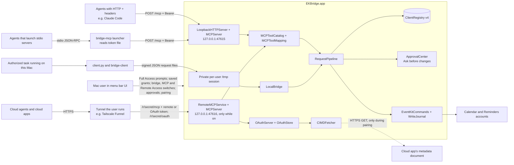

# Architecture and security boundary

## Components and data flow

The app is a menu bar process in the logged-in user's session. `BridgeAppDelegate` owns the bridge, the MCP service and the approval panel, and wires the UI. It also owns the Remote Access service, the OAuth server and the keep-awake assertion. `BridgeAppModel` is the single source of truth for the menu bar extra (`StatusMenuController`), the main window (`MainWindowController`, SwiftUI views hosted in AppKit) and the setup checklist; it refreshes on app activation, EventKit changes, registry changes, bridge, MCP server and Remote Access state changes, OAuth connection changes, and new activity. `ClientRegistry` persists public verifiers, token digests and grants, `RequestPipeline` runs every request after its transport has authenticated the client, `EventKitCommands` performs authorized work, and `WriteJournal` records write identity and outcome. There is no cloud callback or launchd Mach service. The only listener a cloud agent can reach is the Remote Access port, which is off by default and reachable only through a tunnel the user runs.

There are three ways in, and all end in the same pipeline:

| Transport | Caller | Credential | Code |
| --- | --- | --- | --- |
| Private file exchange | `client.py`, which runs the matching Swift `bridge-client` | Ed25519 signing key in `<uuid>.json`; each request is signed | `LocalBridge`, `ClientBridgeProtocol` |
| Loopback HTTP (MCP) | AI agents, directly or through `bridge-mcp` | 256-bit bearer token in `<uuid>.mcp-token` | `Sources/MCP/`, `Sources/MCPLauncher.swift` |
| Loopback HTTP behind a tunnel (Remote Access) | Cloud agents and cloud apps, through a tunnel the user runs | 256-bit remote token in `<uuid>.mcp-remote-token`, or a one-hour OAuth access token from a connection the user approved | `RemoteMCPService`, `OAuthServer`, `OAuthStore`, `CIMDFetcher` in `Sources/MCP/` |

A Python, shell or agent task may use the first two **only if it is executing on the Mac** with the user's authorization. The third is for cloud agents, only for clients the user marked **Allow cloud access**.

`LocalBridge` uses `/tmp/ek-bridge-<uid>/`: an owned mode-0700 root, one active session with `requests/` and `responses/`, an owned lock file, and a `current.json` descriptor. Request/response files are mode 0600. The descriptor gives the local client a current session name, not an authorization secret. The bridge polls every 0.5 seconds; the client waits up to 10 seconds for reads or 60 seconds for writes.

The MCP server is a minimal HTTP/1.1 server on `NWListener`, bound to `127.0.0.1` only (`requiredLocalEndpoint`, plus `acceptLocalOnly`); there's no setting for the address, and a unit test checks the listener parameters. The port defaults to 47615 (`MCPServerPort` in user defaults). The server is off by default (`MCPServerEnabled`). When it's listening, the app writes `mcp-endpoint.json` with the URL, port and its process ID, and removes it when the server stops or the app quits. A listener that fails at runtime gets one restart after a second; a port that's in use is reported, never replaced. After wake, the app restarts the listener if it isn't listening. Protocol details and limits are in [MCP](MCP.md#reference).

Remote Access (`RemoteMCPService`) is a second `LoopbackHTTPServer` on `127.0.0.1`, port 47616 by default (`MCPRemotePort`), open only while Remote Access is on (`RemoteAccessEnabled`, off by default). Tunneled requests arrive from a loopback peer (`tailscaled`, `cloudflared` or `ngrok` is a local process), so the server can't tell local from remote by address; a separate port with its own policy makes the difference structural. A local process that connects to it gains nothing, because it accepts only cloud credentials and its limits are stricter. Every route contains a 22-character secret path (`/r/<secret>`, 128 bits, `RemoteAccessSecretPath`); the gate answers 404 to anything else before reading `Host` or a credential, then checks `Host` against the public address the user entered (`RemoteAccessPublicAddress`) or `127.0.0.1:<port>`/`localhost:<port>`. It runs a second `MCPServer` over the same pipeline; only authentication, rate-limit buckets and the gate differ. `OAuthServer` serves the OAuth endpoints on the same port. `CIMDFetcher` reads a cloud app's client ID metadata document while the user has pairing open. That and **Test**, which fetches the app's own health URL through the tunnel when the user clicks it, are the only outbound requests the app makes. The app never runs a tunnel; Settings shows the commands. Details are in [MCP](MCP.md#remote-access-http) and the [Remote Access threat review](#remote-access-threat-review-050).

`bridge-mcp` (`Contents/MacOS/bridge-mcp`, built without AppKit or EventKit and signed before the app) is a stdio relay for agents that start servers as processes. It has no tool logic and makes no authorization decisions. It reads the token file with the same file-safety checks as `bridge-client`, reads `mcp-endpoint.json` on every connection and accepts only `http://127.0.0.1:<port>/mcp` from it, and before sending the token confirms with `libproc` that the endpoint's process belongs to this user, runs from an app with the same bundle identifier as the app containing the launcher, and holds the listening socket. Its `headers` command prints the `Authorization` header for Claude Code's `headersHelper` under the same checks, and only when the agent's URL equals the served one.

A process may be running while the Mac screen is locked, but actual reachability depends on the local task route, awake state, and logged-in session. A cloud agent cannot address the `/tmp` directory or the MCP port. It reaches the Remote Access port only through a tunnel the user runs, and only while the Mac is awake, logged in and running the app.

### Threads

`ClientRegistry` keeps cached state and persists without locks, so it is used from the main thread only; its entry points assert that with `dispatchPrecondition`. Each listener's HTTP side runs on its own private serial queue (`mcp.http`): accepting connections, parsing, limits, timeouts and the endpoint checks below, including the Remote Access gate and its per-address lockout. A request that passes them hops to the main actor, where authentication, JSON-RPC handling, `RequestPipeline`, `ApprovalCenter` and `EventKitCommands` run, and so do `OAuthServer` and `OAuthStore`. `CIMDFetcher` does each fetch on its own queue and delivers the result on the main actor. The reply hops back to `mcp.http` to be written. The pipeline is callback-based, so a call waiting for approval or EventKit never blocks others. `RateLimiter`, the traffic counters, the Remote Access configuration and the health-check nonces are lock-protected, because they're read on `mcp.http` before the hop.

## Request checks

Each transport authenticates the client its own way, then hands the request to `RequestPipeline.handle(request, clientID:, origin:)`.

**File exchange (CLI).**

1. The client reads its private key file and the current session descriptor, then signs the canonical JSON payload including session, request UUID, command, timestamp, parameters, and client ID.
2. The app validates exact envelope shape and size, the current session, timestamp lifetime (30 seconds, with five seconds of future skew), and replay UUID. `ClientRegistry.authenticateSignature` verifies the signature against the client's public verifier.

**Loopback HTTP (MCP).** On `mcp.http`:

1. HTTP parsing within bounds (head 16 KiB and 64 fields, body 64 KiB, 10-second header and body timeouts, at most 32 connections).
2. Path is `/mcp` (404); `Host` is `127.0.0.1:<port>` or `localhost:<port>` (421); no `Origin` unless allowlisted (403); no tunnel forwarding headers (403); method is POST (405); `Content-Type` is JSON (415); `Accept` allows JSON (406); `Authorization: Bearer` with a token of the right shape. A missing or malformed token counts as a failed authentication and, during a lockout, gets 429 here.

Then on the main actor:

3. `ClientRegistry.authenticateMCPToken` hashes the token with SHA-256 and compares the digest with every active client's in constant time (401 on failure; 503 if the registry can't be read).
4. JSON-RPC parsing (one object, no batches), protocol era detection and header checks, then dispatch. `tools/call` checks the tool name, validates the arguments against the tool's schema, converts times and shapes, and builds exactly one core request with a fresh request ID and, for writes, a fresh `ekb3_` key. Argument errors return to the agent here and are not recorded in Activity.

**Loopback HTTP behind a tunnel (Remote Access).** On that listener's `mcp.http`:

1. HTTP parsing within the same bounds.
2. The path contains the secret, compared without stopping at the first difference (404); `Host` is the public host from Settings or `127.0.0.1:<port>`/`localhost:<port>` (421). The health route needs GET and a nonce issued in the last 30 seconds. OAuth routes go to `OAuthServer` on the main actor; they take no guessable secret, so they have no lockout. For `/mcp`: no `Origin` (403); method is POST (405); `Content-Type` is JSON (415); `Accept` allows JSON (406). While the forwarded address is locked out, a request without a well-formed remote or OAuth token gets 429 here. Tunnel headers aren't refused on this port, and never used for authorization.

Then on the main actor:

3. A remote token (`ekb_mcpr_v1_`) is hashed and compared with the remote digests of active clients that have cloud access on (`ClientRegistry.authenticateRemoteToken`). An OAuth access token (`ekb_oat_v1_`) is looked up by digest in `OAuthStore` and must be unexpired, issued for the current MCP URL, and belong to a client with cloud access on. Anything else, a local `ekb_mcp_v1_` token included, is 401 and counts toward the address's lockout; a valid credential is accepted even from a locked-out address.
4. As step 4 above. The request's origin is `remote`, which selects the remote rate-limit buckets and records `via: remote`. The forwarded address and the tunnel's name are kept in memory for Activity (the last 50 remote requests) and never written.

The local MCP port, for its part, refuses remote and OAuth tokens (401) and any request with tunnel forwarding headers (403).

**Shared pipeline**, in this order:

1. The bridge is on, or `bridge_off`. Then the client isn't paused, or `client_paused` (no rate-limit tokens are taken; `authorize` refuses paused clients too).
2. Rate limits: at most 8 calls in progress per client, then the per-client call and write buckets, or `rate_limited`. Steps 1 and 2 are still recorded in Activity.
3. `ClientRegistry.authorize`: a saved grant for the exact collection and action (client-level commands such as `scope_status` and `list_collections` need only an active client), plus an "accepted" Activity row.
4. `CommandPolicy` rejects unknown or malformed parameters before EventKit access.
5. Recheck the client revision and the bridge (`scope_changed`), and cancellation.
6. For a write from a client set to **Ask me first**: wait for the approval panel (up to 45 seconds), then recheck as in step 5. A declined, unanswered or withdrawn request ends here.
7. Client-level commands are answered inline; everything else goes to `EventKitCommands`, which checks Full Calendar or Reminders access and target writability where needed. For asynchronous reads it rechecks the client revision, the bridge and macOS access before replying. Writes also pass idempotency, target and expected-version checks; `WriteJournal` records a pending write (with its client ID, for the per-client quota) before EventKit is asked to mutate data, and cancellation is checked just before that reservation. A completed same-key retry returns the previous result marked `repeated`. A pending or uncertain write needs reconciliation rather than automatic replay.
8. The result row is recorded with `via`, the agent's reported name and the approval detail, then the reply is sent. MCP results are converted back to the tool's output shape or to an agent-facing error.

A grant edit, key rotation or removal, MCP or remote token issue, reset or removal, a change to Ask before changes or to Allow cloud access, an OAuth connection added or revoked, pausing or resuming, or revocation changes the client's revision. Future requests, asynchronous reads and approval waits that recheck it are denied; a write already committed by EventKit cannot be undone by a later policy change. A policy-store failure stops normal access on every transport. UI-created clients begin with zero grants and without cloud access; enabling the bridge, the MCP server or Remote Access, issuing a token, or approving a cloud app grants no collection access. Writes from a client set to *Allow without asking* proceed without a prompt once a grant exists.

## Local state

| Location | Contents | Boundary |
| --- | --- | --- |
| `~/Library/Application Support/EKBridge/client-credentials/<client UUID>.json` | Ed25519 private signing seed and client UUID | App-managed, owned mode-0600 file in mode-0700 directory |
| `~/Library/Application Support/EKBridge/client-credentials/<client UUID>.mcp-token` | The client's MCP bearer token (`ekb_mcp_v1_` + 64 hex), bare, with no newline, so agents and the launcher can read it directly | Same as the key file. The app writes it and never reads it back, except for an explicit **Copy Token…** |
| `~/Library/Application Support/EKBridge/client-credentials/<client UUID>.mcp-remote-token` | The client's remote token (`ekb_mcpr_v1_` + 64 hex), bare, while the client has cloud access and a remote token | Same as the key file. Read back only for **Copy Remote Token…**; removed when cloud access is turned off or the client is revoked |
| `~/Library/Application Support/EKBridge/client-registry.json` | Schema version 4: public verifiers, SHA-256 digests and issue dates of MCP and remote tokens, cloud access switches, Ask before changes settings, names (unique among active clients), grant masks, revisions, revoke times, and the last 500 activity rows (time, client ID, command, outcome, target calendar or list ID, `via`, reported agent name, approval detail) | Same-user local policy; no private seed or token |
| `~/Library/Application Support/EKBridge/client-registry.v2.backup.json`, `client-registry.v3.backup.json` | One-time copy of the older registry, named after the version read, written before the first write in the new format | Lets a user roll back to an older build; never overwritten |
| `~/Library/Application Support/EKBridge/remote-connections.json` | Remote Access OAuth state: connected cloud apps (bridge client, app name, OAuth client ID, resource URL, SHA-256 digests of the current access and refresh tokens and of recently rotated refresh tokens, expiry and use times) and registered OAuth clients (`dcr_` and `cfg_`, with redirect URIs and, for `cfg_`, the SHA-256 of the secret) | Mode 0600, written atomically with fsync. Fails closed like the registry: a wrong owner, mode, size or content makes OAuth unavailable and the file is never overwritten. No token or secret in the clear |
| `~/Library/Application Support/EKBridge/mcp-endpoint.json` | `{"version":1,"url","port","pid","startedAt"}` while the MCP server listens | Mode 0600, written atomically, removed when the server stops; no secret. A stale file after a crash is harmless because the launcher checks the listener |
| `~/Library/Application Support/EKBridge/write-journal/<client>.json` and `write-journal.json` | Idempotency digests, high-water time, pending/completed write receipts with their client ID, potentially including returned reminder titles. One file per client (4 MB each) so a write rewrites only its client's file; `write-journal.json` keeps entries from before 0.4.0 and entries without a client. Every file is loaded at first use, so keys, occurrence checks and the clock high-water mark stay global. Up to 10,000 entries in all, 2,000 per client | Reconciliation aid; not an EventKit transaction |
| `/tmp/ek-bridge-<uid>/` | Active session descriptor and private request/response files | Per-user local transport; no network access |
| `127.0.0.1:47615` (while on) | The MCP listener | Reachable by every local process of every user; every request needs a token |
| `127.0.0.1:47616` (while Remote Access is on) | The Remote Access listener | Reachable by every local process and, through the user's tunnel, from the internet; only the secret path answers, and MCP needs a remote or OAuth token |
| User defaults, signed app bundle, macOS TCC | Saved bridge choice, MCP server switch and port, Remote Access settings (`RemoteAccessEnabled`, `MCPRemotePort`, `RemoteAccessSecretPath`, `RemoteAccessPublicAddress`, `RemoteAccessAutoOff`, `RemoteAccessOffAt`, `RemoteAccessKeepAwake`), Ask before changes defaults, window and Dock preferences, setup checklist and Activity "last viewed" state, optional verified source pin, privacy grants | Local installation state, not tracked source data |

Activity records omit keys, tokens, request parameters, titles, and item contents. The forwarded address and tunnel of remote requests are kept in memory only, for the last 50, and never stored. They include the target calendar or list **ID** when the request named one; the app looks up the current name when it shows the row and never stores it. The agent name is what the agent reported, sanitized, at most 64 bytes, and always shown "as reported". The approval panel shows titles on screen but never stores them. No request or response bodies are logged; Settings ▸ Developer shows MCP traffic counts only. **The journal is different:** completed write receipts can include item IDs, reminder titles, and schedule summaries. Do not publish those files or raw diagnostic logs. `build/` is ignored and can contain signed binaries or local test output. Since 0.6.0, recurring reminder completion no longer uses a verified source ID pinned in `Info.plist`; it uses an allowlist of account types and rule shapes in `RecurringReminderCompletion.swift` that a supervised probe has verified (spike S6). A pinned ID in an older installed bundle is ignored.

## Threat model and limits

The file ownership checks, signatures, tokens, strict scopes, and grant revision help prevent accidental cross-client or cross-collection access and keep other macOS user accounts out. They do **not** stop malicious code running as the **same macOS user**: that code can read a mode-0600 key or token file, read agents' configs, or alter the same-user registry. Code signing the app does not make that user account an isolated security principal. A task runner or agent must apply its own authorization rules before acting on a specific user request.

The journal is not atomic with EventKit or cloud sync. A process exit after EventKit saves but before response persistence can leave an uncertain result. EventKit IDs and timestamps can change after provider sync, and different Calendar/Reminders providers can interpret all-day, due, recurrence, and alarm data differently. The app deliberately rejects shapes it cannot round-trip or safely mutate.

### MCP threat review (0.4.0)

The MCP adapter needed a new threat review before it shipped. What changed:

| | Before (0.3.0) | After (0.4.0) |
| --- | --- | --- |
| Entry points | `/tmp/ek-bridge-<uid>/` (mode 0700: only this user can reach it) | Same, plus a TCP port on 127.0.0.1 that every local process of every user can connect to |
| Credential | Ed25519 seed in a 0600 file; signature over each request | Same, plus a 256-bit bearer token in a 0600 file, sent on each HTTP request |
| Callers | Scripts the user wrote | Also LLM agents whose behavior is partly driven by the data they read |
| Writes | Silent once granted | Optionally confirmed per change (Ask before changes) |

| # | Threat | Mitigation | Residual risk |
| --- | --- | --- | --- |
| T1 | Another macOS user on the same Mac connects to the port. | A bearer token is required on every request. Tokens are 256-bit and live in the owner's 0600 files inside a 0700 directory. Without one: 401, a lockout after repeated failures, and coalesced Activity rows. | None practical. |
| T2 | A web page (CSRF, DNS rebinding to 127.0.0.1) drives the server from a browser. | `Host` allowlist (421); `Origin` must be absent (403); `Authorization` and `application/json` make every request non-simple, and CORS preflights are never answered; tokens are never in URLs. | None known. |
| T3 | A malicious process running as the same user. | No change from the CLI: it can read token files, agent configs and the registry, and act as any client within that client's grants. Documented, not solved. | Unchanged. Same-user code is outside the boundary. |
| T4 | Prompt injection: text in an event or reminder (for example an invitation from someone else) tells the agent to delete, change or exfiltrate. | Least privilege (no access by default; tools appear only for granted actions); Ask before changes on by default for agent clients; an app-side panel the agent can't answer; server instructions and tool descriptions say titles are data; titles capped at 200 bytes; Activity audits every call; per-client rate limits stop runaway loops. | An agent can still read granted data and send it elsewhere through its other tools. [MCP](MCP.md#create-a-client-for-the-agent) advises Read only where needed and one client per agent. |
| T5 | A compromised or careless agent with a valid token. | Grants, approvals, rate limits, and cut-off on the next request (bridge off, Remove MCP Access, Revoke). | Writes already committed by EventKit can't be undone. |
| T6 | Token leaks through config files, shell history, the clipboard or screenshots. | The recommended setups keep the token out of configs (launcher, `headersHelper`, `${file:}`). **Copy Token…** asks first, uses concealed, transient pasteboard types and clears after 90 s. The token is never displayed. Its `ekb_mcp_v1_` prefix allows secret scanning. Reset is one click. | A user who pastes the token into a project file can still commit it; the confirmation warns. |
| T7 | Exposure beyond the Mac (misconfiguration, tunnels, port forwarding). | The bind address is hard-coded to 127.0.0.1 and unit-tested; there's no setting for it; the `Host` allowlist and the tunnel-header check refuse tunneled requests on the MCP port. Since 0.5.0, cloud access goes through the separate Remote Access port instead (T16–T23), and local tokens are refused there. | A reverse proxy that rewrites `Host` and strips those headers is deliberate circumvention; the docs say not to, and point tunnels at the Remote Access port. |
| T8 | Local denial of service. | At most 32 connections; header, body and time limits with fixed deadlines (the head within 10 s of its first byte, the body within 10 s of the head), so trickled bytes don't keep a connection; reading pauses while 4 requests wait on a connection, so pipelining can't grow memory; per-client in-flight limits; the auth-failure lockout; Activity coalescing. | A local process can still occupy connections. Acceptable on one's own Mac. |
| T9 | Port squatting: another user's process binds 47615 first and harvests tokens. | The app reports "port in use". The launcher and `headers` verify through `libproc`, before every request, that the listener is this user's EK Bridge; a crashed app's stale endpoint file can't lead the token to a process that took the port since. A second copy of the app never removes the running copy's endpoint file. | Setups with a literal token or `${file:}` don't get this check; the Connect tab says so for those methods. |
| T10 | Spoofed agent identity (`clientInfo`). | Display only, always labelled "as reported". Identity comes from the token. | None. |
| T11 | Confused deputy / token passthrough. | The server accepts only tokens it issued, and passes no token on. Its outbound requests (0.5.0) are the CIMD metadata fetch during pairing (T22) and Settings' **Test** of its own health URL; neither carries a credential. | N/A |
| T12 | Accidental or tricked approval. | A non-activating panel (keystrokes in the terminal can't approve); the client name comes from the registry, not the agent; deletes use a destructive button; the summary is built from the request and a fresh EventKit lookup, not from agent prose. | The user can approve something they misread. |
| T13 | Cross-client journal replay: a client presents another client's idempotency key. | Keys are returned only to the client that used them; the grant check runs before the journal; replay needs identical arguments. | Negligible. Revisit if keys are ever shown in the UI. |
| T14 | Privacy of logs. | No request or response bodies are logged. Activity stores codes, IDs, `via` and the agent name. Developer counters are numbers only. The approval summary is shown, never stored. | Agents and their providers keep their own transcripts, outside the app's control; the New Client sheet says so. |
| T15 | Supply chain. | No new dependencies; plain `swiftc`; the launcher is signed with the app. | Unchanged. |

**Decision record.** Static per-client bearer tokens are allowed by MCP, whose guidance for local HTTP servers is to require an authorization token. OAuth would add an authorization server, browser flows and refresh tokens: real complexity and no security gain against T1–T3 on a single-user Mac. The local port doesn't offer it. The token is checked with plain SHA-256, deliberately: it has 256 random bits, so there's nothing to brute-force and a slow password hash would only add latency. Remote access for cloud agents shipped in 0.5.0 with its own review, below; OAuth exists there only, because claude.ai, ChatGPT and Gemini Enterprise can't send a fixed token.

### Remote Access threat review (0.5.0)

Remote Access makes the bridge reachable from the internet, through a tunnel the user runs. What changed:

| | Before (0.4.0) | After (0.5.0), while Remote Access is on |
| --- | --- | --- |
| Entry points | The `/tmp` exchange and the MCP port on 127.0.0.1 | Same, plus a second loopback port that the user's tunnel exposes at a public HTTPS address |
| Credentials | Signing keys and local MCP tokens, on this Mac only | Also a remote token per client, pasted into a vendor's settings, and OAuth access and refresh tokens held by cloud apps |
| Callers | Scripts and agents on this Mac | Also cloud agents, often running while the user is away |
| Outbound traffic | None | An HTTPS fetch of a cloud app's metadata document during pairing, and **Test**'s request to the app's own health URL |

| # | Threat | Mitigation | Residual risk |
| --- | --- | --- | --- |
| T16 | Internet exposure: scanning, guessing and flooding through the tunnel. | Off by default, with a confirmation; per-client **Allow cloud access**, off by default; a 128-bit secret path, so scanners get 404 before `Host` or a credential is read; a `Host` allowlist (421); 256-bit tokens; a failed-authentication lockout per forwarded address (more than 30 a minute: 429 for 5 minutes), which only refuses requests without a valid credential, so an attacker who claims someone else's address can't lock out working agents, and which shares one overflow key past 1,000 addresses; remote rate limits per client (60 calls and 10 writes a minute, within the shared 250 writes a day); **Turn Off Remote Access** in the menu, the menu bar globe, and optional automatic turn-off. | Forwarded addresses can be spoofed, so the lockout slows guessing rather than identifying callers; 256-bit tokens make guessing moot. A flood can still occupy the port's 32 connections while Remote Access is on. |
| T17 | A third party holds a credential: the vendor stores the remote token, or a cloud app's refresh token. | Remote credentials are separate from local ones: a remote or OAuth token is refused on the MCP port and a local token on the Remote Access port. One remote token per client, reset in one click; per-connection **Revoke**; access tokens last an hour and are bound to the MCP URL; refresh tokens rotate on every use and a reused rotated token revokes the connection (except an immediate retry within 30 s whose new tokens weren't used); codes are single-use and a replayed code revokes what it produced; everything stored as SHA-256 digests, in 0600 files that fail closed; **Copy Remote Token…** asks first and clears the clipboard after 90 s; resetting the path or changing the address ends every OAuth connection; Activity shows each cloud client's use. | A vendor breach exposes the token until the user resets or revokes it. The token works only through the user's tunnel URL, within the client's grants. |
| T18 | Vendor-side data handling: calendar data flows to the cloud agent and its logs. | The confirmation, the Cloud section and the setup texts say so. The app suggests a separate client per cloud agent with only the access it needs, and shows a one-line summary of what the client can use from the internet. | Outside the app's control once read. |
| T19 | Unattended agents: Copilot and the APIs run tools without approval, and cloud runs happen while the user is away. | Ask before changes applies to cloud calls as chosen; unanswered changes are declined after 45 s. The setups for no-approval agents recommend Read-only grants and include only the read tools (Copilot's `tools`, the Responses API's `allowed_tools`). Rate limits and the daily write cap hold. | With *Allow without asking*, the grants are the only limit. |
| T20 | A tunnel pointed at the MCP port. | The MCP port refuses requests with tunnel forwarding headers (403) and a foreign `Host` (421), and the remote credentials don't work there. Local tokens are refused remotely anyway. | A proxy that rewrites `Host` and strips the headers is deliberate circumvention (T7). |
| T21 | Consent spam or phishing through OAuth. | Nothing is fetched or shown on the Mac unless the user opened a 10-minute pairing window for one client; dynamic registration is refused outside a window. Each request shows a six-digit code in the browser and on the Mac, the app's name and metadata URL, and where the browser will return. Allow is enabled one second after the sheet appears, and a new request never replaces a sheet that's open: it waits. At most 3 requests wait. Redirect URIs must match exactly; `state` and `iss` are returned; PKCE S256 is required; one connection per window. `cfg_` clients can pair only with the bridge client they were made for, and their secrets are stored as SHA-256 digests. | A user who allows without comparing the codes can connect the wrong app; it gets only that client's grants, and **Revoke** ends it. App names are self-reported, so the sheet labels the metadata URL and return host. |
| T22 | SSRF through the CIMD fetch. | Fetched only during pairing. `https` with a DNS name only, never an IP literal; the name is resolved first and refused if any address isn't public, so nothing, not even a TCP SYN, reaches a private, loopback or link-local address; the connection goes to the checked address with TLS verified for the name, and the connected address is checked again before any request bytes go out. No proxies, no redirects, 16 KB, 5 s, cached an hour; the document must name its own URL. No credential is sent. | A public server can see that the Mac fetched it. |
| T23 | Edge decryption: Cloudflare and ngrok end TLS at their edge. | Each tunnel's notes say who can read the traffic. Tailscale Funnel is recommended because TLS ends on the Mac. | A user who picks an edge-terminating tunnel trusts that provider with the traffic. |

### Full item fields threat review (0.6.0)

0.6.0 reads and writes every field EventKit exposes on events and reminders (plan 03). Notes, locations, URLs, alarms, recurrence, availability and priority go through the same path as titles: grant and `CommandPolicy` before EventKit, the journal, a readback of every written field (a mismatch removes a new item or restores an update), and Ask before changes. Moving an item needs Edit on the source and Create on the destination, both checked by the registry before EventKit and again before the write. No new grant actions were added.

| # | Threat | Mitigation | Residual |
| --- | --- | --- | --- |
| T24 | Prompt injection through more text: notes, locations, URLs and attendee names are written by other people (invitations, shared calendars) and are long enough to carry instructions. | Server instructions and the read tools' descriptions say these fields are data, never instructions. List reads show only a 300-byte notes preview. Agent-facing errors never echo field contents. Ask before changes still gates writes. | A model can still be misled by text it reads; the user approves writes, not reads. |
| T25 | Phishing links: an agent writes a deceptive URL that the user later taps in Calendar. | Only `http`, `https`, `mailto` and `tel` can be written, complete as given; reads flag other schemes with `url_scheme_allowed: false`. The approval panel shows the host in bold and labels other schemes. | A lookalike `https` host is still possible; the user sees the host before allowing. |
| T26 | Attendee data leaving the Mac: other people's names and emails go to the agent and its provider, and with Remote Access to a cloud vendor. | It's the user's own calendar, read under a Read grant. List reads carry only counts and the user's own status; `get_event` the attendees. Activity, the journal and logs store none of it; receipts never include notes or attendees. | An agent granted Read on a calendar sees who the user meets with. |
| T27 | Mass change through spans: one `span: all` or series delete changes hundreds of occurrences. | The approval panel says how many occurrences a `future` or `all` change touches, and every delete uses the destructive style; a request still counts as one write for rate limits. Two keys can't delete the same occurrence (`already_applied`). | With Allow without asking, nothing stops a series delete the client is granted. |
| T28 | Notifications to other people: editing an invitation can email every attendee. | Events with attendees are read-only (`invitation_read_only`) until spike S3 shows what each provider sends. | None while the refusal stands. |

The secret path and the public address live in user defaults: they aren't credentials. The listener and the OAuth server run only while Remote Access is on, but OAuth connections persist across restarts until revoked or expired. Approving changes from a phone, a **Start for me** button for Tailscale, and IP allowlists per agent are not implemented.

An early signed XPC design (never deployed; removed from the tree, still in the git history) is not the current transport. A signed peer check does not by itself solve the same-user credential or signed-client deputy problem. Any switch to XPC, a persistent agent, another listener, Keychain storage, or per-process isolation needs a new threat review and separate implementation.

## Client registry versions

Version 3 (app 0.3.0) changed the registry in one step:

- Only active clients count toward the limit of 32. Revoked records are kept for history, capped at 200; when a revoke goes past the cap, the oldest revoked records are dropped first (records revoked before version 3 have no revoke time and go first).
- Clients can be renamed. The name isn't part of authorization, so renaming doesn't change the revision and requests in flight aren't affected. New and renamed clients must have a name no other active client uses, ignoring case and surrounding spaces. A registry upgraded from version 2 can still hold two active clients with one name; `client.py --client NAME` then refuses and lists their IDs, and the app's copied commands use the client ID instead.
- Activity rows record the target calendar or list ID (same limits as grant targets: at most 512 bytes, no control characters).

Version 4 (app 0.4.0) adds MCP:

- Clients gain `mcpVerifier` (the SHA-256 of the token, unique among active clients; none means no MCP access), `mcpIssuedAt`, and `approval` (`ask` or `allow`; missing means `allow`, the earlier behavior). `verifier` may be empty for a client with no command-line key. Revoked clients have neither.
- Activity rows gain `via` (`cli` or `mcp`; none for older rows), `agent` (the reported name) and `approval` (`user`, `window`, `denied` or `timeout`).
- `bridge-client` reads versions 2–4 for `--client NAME` and ignores the new fields.

App 0.5.0 adds Remote Access to version 4 rather than making a version 5, because 0.4.0 was never released on its own:

- Clients gain `remoteEnabled` (Allow cloud access; missing means off), `remoteVerifier` (the SHA-256 of the remote token, unique among active clients; allowed only while cloud access is on) and `remoteIssuedAt`. Revoked clients have none of them.
- Activity rows may have `via: remote`.
- OAuth connections aren't in the registry; they're in `remote-connections.json`.

App 0.7.0 adds pausing, also within version 4:

- Clients gain `paused` (`true`, or missing for not paused) and `pausedAt`. Pausing changes nothing else in the record, so resuming (which removes both fields) restores the client exactly. Revoked clients are never paused; a file with a revoked, paused client fails closed.
- Paused clients are still active: they count toward the limit of 32, keep unique names and token digests, and authenticate. The pipeline refuses them after authentication, so the Activity row names the client.

A version 2 or 3 file loads unchanged and is written as version 4 on the next change, after a one-time backup named after the version read (`client-registry.v3.backup.json` or `client-registry.v2.backup.json`, mode 0600, never overwritten). Existing clients keep working with *Allow without asking*. **An older build fails closed on a newer registry** ("client settings can't be read"). To roll back, quit the app and restore the backup over `client-registry.json`; changes made since the upgrade are lost, including MCP access (leftover `.mcp-token` files no longer work).
