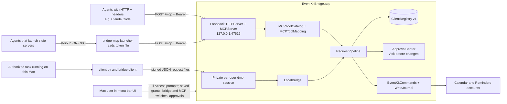

# Architecture and security boundary

## Components and data flow

The app is a menu bar process in the logged-in user's session. `BridgeAppDelegate` owns the bridge, the MCP service and the approval panel, and wires the UI. `BridgeAppModel` is the single source of truth for the menu bar extra (`StatusMenuController`), the main window (`MainWindowController`, SwiftUI views hosted in AppKit) and the setup checklist; it refreshes on app activation, EventKit changes, registry changes, bridge and MCP server state changes, and new activity. `ClientRegistry` persists public verifiers, token digests and grants, `RequestPipeline` runs every request after its transport has authenticated the client, `EventKitCommands` performs authorized work, and `WriteJournal` records write identity and outcome. There is no cloud callback, remote listener or launchd Mach service.

There are two ways in, and both end in the same pipeline:

| Transport | Caller | Credential | Code |
| --- | --- | --- | --- |
| Private file exchange | `client.py`, which runs the matching Swift `bridge-client` | Ed25519 signing key in `<uuid>.json`; each request is signed | `LocalBridge`, `ClientBridgeProtocol` |
| Loopback HTTP (MCP) | AI agents, directly or through `bridge-mcp` | 256-bit bearer token in `<uuid>.mcp-token` | `Sources/MCP/`, `Sources/MCPLauncher.swift` |

A Python, shell or agent task may use either **only if it is executing on the Mac** with the user's authorization.

`LocalBridge` uses `/tmp/eventkit-bridge-<uid>/`: an owned mode-0700 root, one active session with `requests/` and `responses/`, an owned lock file, and a `current.json` descriptor. Request/response files are mode 0600. The descriptor gives the local client a current session name, not an authorization secret. The bridge polls every 0.5 seconds; the client waits up to 10 seconds for reads or 60 seconds for writes.

The MCP server is a minimal HTTP/1.1 server on `NWListener`, bound to `127.0.0.1` only (`requiredLocalEndpoint`, plus `acceptLocalOnly`); there's no setting for the address, and a unit test checks the listener parameters. The port defaults to 47615 (`MCPServerPort` in user defaults). The server is off by default (`MCPServerEnabled`). When it's listening, the app writes `mcp-endpoint.json` with the URL, port and its process ID, and removes it when the server stops or the app quits. A listener that fails at runtime gets one restart after a second; a port that's in use is reported, never replaced. After wake, the app restarts the listener if it isn't listening. Protocol details and limits are in [MCP](MCP.md#reference).

`bridge-mcp` (`Contents/MacOS/bridge-mcp`, built without AppKit or EventKit and signed before the app) is a stdio relay for agents that start servers as processes. It has no tool logic and makes no authorization decisions. It reads the token file with the same file-safety checks as `bridge-client`, reads `mcp-endpoint.json` on every connection and accepts only `http://127.0.0.1:<port>/mcp` from it, and before sending the token confirms with `libproc` that the endpoint's process belongs to this user, runs from an app with the same bundle identifier as the app containing the launcher, and holds the listening socket. Its `headers` command prints the `Authorization` header for Claude Code's `headersHelper` under the same checks, and only when the agent's URL equals the served one.

A process may be running while the Mac screen is locked, but actual reachability depends on the local task route, awake state, and logged-in session. A cloud agent cannot address the `/tmp` directory or the loopback port.

### Threads

`ClientRegistry` keeps cached state and persists without locks, so it is used from the main thread only; its entry points assert that with `dispatchPrecondition`. The HTTP side runs on one private serial queue (`mcp.http`): accepting connections, parsing, limits, timeouts and the endpoint checks below. A request that passes them hops to the main actor, where authentication, JSON-RPC handling, `RequestPipeline`, `ApprovalCenter` and `EventKitCommands` run. The reply hops back to `mcp.http` to be written. The pipeline is callback-based, so a call waiting for approval or EventKit never blocks others. `RateLimiter` and the traffic counters are lock-protected, because the failed-authentication lockout is checked on `mcp.http` before the hop.

## Request checks

Each transport authenticates the client its own way, then hands the request to `RequestPipeline.handle(request, clientID:, origin:)`.

**File exchange (CLI).**

1. The client reads its private key file and the current session descriptor, then signs the canonical JSON payload including session, request UUID, command, timestamp, parameters, and client ID.
2. The app validates exact envelope shape and size, the current session, timestamp lifetime (30 seconds, with five seconds of future skew), and replay UUID. `ClientRegistry.authenticateSignature` verifies the signature against the client's public verifier.

**Loopback HTTP (MCP).** On `mcp.http`:

1. HTTP parsing within bounds (head 16 KiB and 64 fields, body 64 KiB, 10-second header and body timeouts, at most 32 connections).
2. Path is `/mcp` (404); `Host` is `127.0.0.1:<port>` or `localhost:<port>` (421); no `Origin` unless allowlisted (403); no tunnel forwarding headers (403); method is POST (405); `Content-Type` is JSON (415); `Accept` allows JSON (406); `Authorization: Bearer` with a token of the right shape. A missing or malformed token counts as a failed authentication and, during a lockout, gets 429 here.

Then on the main actor:

3. `ClientRegistry.authenticateMCPToken` hashes the token with SHA-256 and compares the digest with every active client's in constant time (401 on failure; 503 if the registry can't be read).
4. JSON-RPC parsing (one object, no batches), protocol era detection and header checks, then dispatch. `tools/call` checks the tool name, validates the arguments against the tool's schema, converts times and shapes, and builds exactly one core request with a fresh request ID and, for writes, a fresh `ekb3_` key. Argument errors return to the agent here and are not recorded in Activity.

**Shared pipeline**, in this order:

1. The bridge is on, or `bridge_off`.
2. Rate limits: at most 8 calls in progress per client, then the per-client call and write buckets, or `rate_limited`. Steps 1 and 2 are still recorded in Activity.
3. `ClientRegistry.authorize`: a saved grant for the exact collection and action (client-level commands such as `scope_status` and `list_collections` need only an active client), plus an "accepted" Activity row.
4. `CommandPolicy` rejects unknown or malformed parameters before EventKit access.
5. Recheck the client revision and the bridge (`scope_changed`), and cancellation.
6. For a write from a client set to **Ask me first**: wait for the approval panel (up to 45 seconds), then recheck as in step 5. A declined, unanswered or withdrawn request ends here.
7. Client-level commands are answered inline; everything else goes to `EventKitCommands`, which checks Full Calendar or Reminders access and target writability where needed. For asynchronous reads it rechecks the client revision, the bridge and macOS access before replying. Writes also pass idempotency, target and expected-version checks; `WriteJournal` records a pending write (with its client ID, for the per-client quota) before EventKit is asked to mutate data, and cancellation is checked just before that reservation. A completed same-key retry returns the previous result marked `repeated`. A pending or uncertain write needs reconciliation rather than automatic replay.
8. The result row is recorded with `via`, the agent's reported name and the approval detail, then the reply is sent. MCP results are converted back to the tool's output shape or to an agent-facing error.

A grant edit, key rotation or removal, token issue, reset or removal, a change to Ask before changes, or revocation changes the client's revision. Future requests, asynchronous reads and approval waits that recheck it are denied; a write already committed by EventKit cannot be undone by a later policy change. A policy-store failure stops normal access on both transports. UI-created clients begin with zero grants; enabling the bridge or the MCP server, or issuing a token, grants no collection access. Writes from a client set to *Allow without asking* proceed without a prompt once a grant exists.

## Local state

| Location | Contents | Boundary |
| --- | --- | --- |
| `~/Library/Application Support/EventKitBridge/client-credentials/<client UUID>.json` | Ed25519 private signing seed and client UUID | App-managed, owned mode-0600 file in mode-0700 directory |
| `~/Library/Application Support/EventKitBridge/client-credentials/<client UUID>.mcp-token` | The client's MCP bearer token (`ekb_mcp_v1_` + 64 hex), bare, with no newline, so agents and the launcher can read it directly | Same as the key file. The app writes it and never reads it back, except for an explicit **Copy Token…** |
| `~/Library/Application Support/EventKitBridge/client-registry.json` | Schema version 4: public verifiers, SHA-256 token digests and issue dates, Ask before changes settings, names (unique among active clients), grant masks, revisions, revoke times, and the last 500 activity rows (time, client ID, command, outcome, target calendar or list ID, `via`, reported agent name, approval detail) | Same-user local policy; no private seed or token |
| `~/Library/Application Support/EventKitBridge/client-registry.v2.backup.json`, `client-registry.v3.backup.json` | One-time copy of the older registry, named after the version read, written before the first write in the new format | Lets a user roll back to an older build; never overwritten |
| `~/Library/Application Support/EventKitBridge/mcp-endpoint.json` | `{"version":1,"url","port","pid","startedAt"}` while the MCP server listens | Mode 0600, written atomically, removed when the server stops; no secret. A stale file after a crash is harmless because the launcher checks the listener |
| `~/Library/Application Support/EventKitBridge/write-journal/<client>.json` and `write-journal.json` | Idempotency digests, high-water time, pending/completed write receipts with their client ID, potentially including returned reminder titles. One file per client (4 MB each) so a write rewrites only its client's file; `write-journal.json` keeps entries from before 0.4.0 and entries without a client. Every file is loaded at first use, so keys, occurrence checks and the clock high-water mark stay global. Up to 10,000 entries in all, 2,000 per client | Reconciliation aid; not an EventKit transaction |
| `/tmp/eventkit-bridge-<uid>/` | Active session descriptor and private request/response files | Per-user local transport; no network access |
| `127.0.0.1:47615` (while on) | The MCP listener | Reachable by every local process of every user; every request needs a token |
| User defaults, signed app bundle, macOS TCC | Saved bridge choice, MCP server switch and port, Ask before changes defaults, window and Dock preferences, setup checklist and Activity "last viewed" state, optional verified source pin, privacy grants | Local installation state, not tracked source data |

Activity records omit keys, tokens, request parameters, titles, and item contents. They include the target calendar or list **ID** when the request named one; the app looks up the current name when it shows the row and never stores it. The agent name is what the agent reported, sanitized, at most 64 bytes, and always shown "as reported". The approval panel shows titles on screen but never stores them. No request or response bodies are logged; Settings ▸ Developer shows MCP traffic counts only. **The journal is different:** completed write receipts can include item IDs, reminder titles, and schedule summaries. Do not publish those files or raw diagnostic logs. `build/` is ignored and can contain signed binaries or local test output. The source `Info.plist` intentionally has an empty verified iCloud reminder source ID, so the special recurring-completion path fails closed in a default build.

## Threat model and limits

The file ownership checks, signatures, tokens, strict scopes, and grant revision help prevent accidental cross-client or cross-collection access and keep other macOS user accounts out. They do **not** stop malicious code running as the **same macOS user**: that code can read a mode-0600 key or token file, read agents' configs, or alter the same-user registry. Code signing the app does not make that user account an isolated security principal. A task runner or agent must apply its own authorization rules before acting on a specific user request.

The journal is not atomic with EventKit or cloud sync. A process exit after EventKit saves but before response persistence can leave an uncertain result. EventKit IDs and timestamps can change after provider sync, and different Calendar/Reminders providers can interpret all-day, due, recurrence, and alarm data differently. The app deliberately rejects shapes it cannot round-trip or safely mutate.

### MCP threat review (0.4.0)

The MCP adapter needed a new threat review before it shipped. What changed:

| | Before (0.3.0) | After (0.4.0) |
| --- | --- | --- |
| Entry points | `/tmp/eventkit-bridge-<uid>/` (mode 0700: only this user can reach it) | Same, plus a TCP port on 127.0.0.1 that every local process of every user can connect to |
| Credential | Ed25519 seed in a 0600 file; signature over each request | Same, plus a 256-bit bearer token in a 0600 file, sent on each HTTP request |
| Callers | Scripts the user wrote | Also LLM agents whose behavior is partly driven by the data they read |
| Writes | Silent once granted | Optionally confirmed per change (Ask before changes) |

| # | Threat | Mitigation | Residual risk |
| --- | --- | --- | --- |
| T1 | Another macOS user on the same Mac connects to the port. | A bearer token is required on every request. Tokens are 256-bit and live in the owner's 0600 files inside a 0700 directory. Without one: 401, a lockout after repeated failures, and coalesced Activity rows. | None practical. |
| T2 | A web page (CSRF, DNS rebinding to 127.0.0.1) drives the server from a browser. | `Host` allowlist (421); `Origin` must be absent (403); `Authorization` and `application/json` make every request non-simple, and CORS preflights are never answered; tokens are never in URLs. | None known. |
| T3 | A malicious process running as the same user. | No change from the CLI: it can read token files, agent configs and the registry, and act as any client within that client's grants. Documented, not solved. | Unchanged. Same-user code is outside the boundary. |
| T4 | Prompt injection: text in an event or reminder (for example an invitation from someone else) tells the agent to delete, change or exfiltrate. | Least privilege (no access by default; tools appear only for granted actions); Ask before changes on by default for agent clients; an app-side panel the agent can't answer; server instructions and tool descriptions say titles are data; titles capped at 200 bytes; Activity audits every call; per-client rate limits stop runaway loops. | An agent can still read granted data and send it elsewhere through its other tools. [MCP](MCP.md#create-a-client-for-the-agent) advises Read only where needed and one client per agent. |
| T5 | A compromised or careless agent with a valid token. | Grants, approvals, rate limits, and cut-off on the next request (bridge off, Remove MCP Access, Revoke). | Writes already committed by EventKit can't be undone. |
| T6 | Token leaks through config files, shell history, the clipboard or screenshots. | The recommended setups keep the token out of configs (launcher, `headersHelper`, `${file:}`). **Copy Token…** asks first, uses concealed, transient pasteboard types and clears after 90 s. The token is never displayed. Its `ekb_mcp_v1_` prefix allows secret scanning. Reset is one click. | A user who pastes the token into a project file can still commit it; the confirmation warns. |
| T7 | Exposure beyond the Mac (misconfiguration, tunnels, port forwarding). | The bind address is hard-coded to 127.0.0.1 and unit-tested; there's no setting for it; the `Host` allowlist and the tunnel-header check refuse tunneled requests. | A reverse proxy that rewrites `Host` and strips those headers is deliberate circumvention; the docs say not to. |
| T8 | Local denial of service. | Connection, header, body and time limits; per-client in-flight limits; the auth-failure lockout; Activity coalescing. | A local process can still occupy connections. Acceptable on one's own Mac. |
| T9 | Port squatting: another user's process binds 47615 first and harvests tokens. | The app reports "port in use". The launcher and `headers` verify through `libproc` that the listener is this user's EventKit Bridge before sending the token. | Setups with a literal token or `${file:}` don't get this check; the Connect tab says so for those methods. |
| T10 | Spoofed agent identity (`clientInfo`). | Display only, always labelled "as reported". Identity comes from the token. | None. |
| T11 | Confused deputy / token passthrough. | The server makes no outbound requests and accepts only tokens it issued. | N/A |
| T12 | Accidental or tricked approval. | A non-activating panel (keystrokes in the terminal can't approve); the client name comes from the registry, not the agent; deletes use a destructive button; the summary is built from the request and a fresh EventKit lookup, not from agent prose. | The user can approve something they misread. |
| T13 | Cross-client journal replay: a client presents another client's idempotency key. | Keys are returned only to the client that used them; the grant check runs before the journal; replay needs identical arguments. | Negligible. Revisit if keys are ever shown in the UI. |
| T14 | Privacy of logs. | No request or response bodies are logged. Activity stores codes, IDs, `via` and the agent name. Developer counters are numbers only. The approval summary is shown, never stored. | Agents and their providers keep their own transcripts, outside the app's control; the New Client sheet says so. |
| T15 | Supply chain. | No new dependencies; plain `swiftc`; the launcher is signed with the app. | Unchanged. |

**Decision record.** Static per-client bearer tokens are allowed by MCP, whose guidance for local HTTP servers is to require an authorization token. OAuth would add an authorization server, browser flows and refresh tokens: real complexity and no security gain against T1–T3 on a single-user Mac. It is deferred. The token is checked with plain SHA-256, deliberately: it has 256 random bits, so there's nothing to brute-force and a slow password hash would only add latency. Remote access for cloud agents (a separate port behind a user-run tunnel) is designed but not implemented, and needs its own threat review.

The [XPC design note](../Candidate/ARCHITECTURE.md) is historical source-only exploration. Its signed-peer idea is not the current transport; it does not by itself solve the same-user credential or signed-client deputy problem. Any switch to XPC, a persistent agent, a remote listener, Keychain storage, or per-process isolation needs a new threat review and separate implementation.

## Client registry versions

Version 3 (app 0.3.0) changed the registry in one step:

- Only active clients count toward the limit of 32. Revoked records are kept for history, capped at 200; when a revoke goes past the cap, the oldest revoked records are dropped first (records revoked before version 3 have no revoke time and go first).
- Clients can be renamed. The name isn't part of authorization, so renaming doesn't change the revision and requests in flight aren't affected. New and renamed clients must have a name no other active client uses, ignoring case and surrounding spaces. A registry upgraded from version 2 can still hold two active clients with one name; `client.py --client NAME` then refuses and lists their IDs, and the app's copied commands use the client ID instead.
- Activity rows record the target calendar or list ID (same limits as grant targets: at most 512 bytes, no control characters).

Version 4 (app 0.4.0) adds MCP:

- Clients gain `mcpVerifier` (the SHA-256 of the token, unique among active clients; none means no MCP access), `mcpIssuedAt`, and `approval` (`ask` or `allow`; missing means `allow`, the earlier behavior). `verifier` may be empty for a client with no command-line key. Revoked clients have neither.
- Activity rows gain `via` (`cli` or `mcp`; none for older rows), `agent` (the reported name) and `approval` (`user`, `window`, `denied` or `timeout`).
- `bridge-client` reads versions 2–4 for `--client NAME` and ignores the new fields.

A version 2 or 3 file loads unchanged and is written as version 4 on the next change, after a one-time backup named after the version read (`client-registry.v3.backup.json` or `client-registry.v2.backup.json`, mode 0600, never overwritten). Existing clients keep working with *Allow without asking*. **An older build fails closed on a newer registry** ("client settings can't be read"). To roll back, quit the app and restore the backup over `client-registry.json`; changes made since the upgrade are lost, including MCP access (leftover `.mcp-token` files no longer work).
