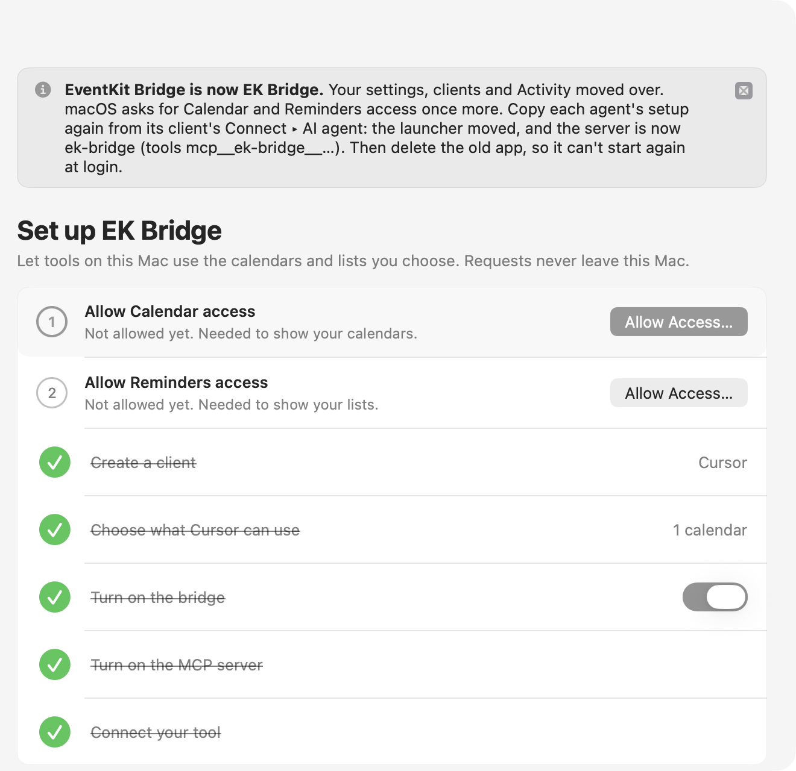

# Setup, signing, and macOS access

Most people install a release. Building from source is for contributors, or for running a build you reviewed yourself. Either way, work on a Mac you control, with a logged-in graphical session for the menu bar UI.

## Install a release

1. Download [`EKBridge.dmg`](https://github.com/bereciartua/ek-bridge/releases/latest/download/EKBridge.dmg), the latest release (notes and checksums on [Releases](https://github.com/bereciartua/ek-bridge/releases/latest)), open it, and drag the app to **Applications**. Or run `brew install --cask bereciartua/tap/ek-bridge`: the same app, from the same DMG, with `bridge-client` linked into Homebrew's `bin`.
2. Open the app and follow the setup checklist ([macOS permissions and first run](#macos-permissions-and-first-run)).
3. For scripts, choose **Settings ▸ Developer ▸ Install Command-Line Tool**. It links the app's `bridge-client` into `~/.local/bin` without asking for an administrator password. If your shell can't find `bridge-client`, add `~/.local/bin` to your `PATH` (for zsh: `echo 'export PATH="$HOME/.local/bin:$PATH"' >> ~/.zprofile`, then open a new Terminal window). The link points into the app, so install it again if you move the app.

The app needs macOS 14 or later, on Apple silicon or Intel. Releases are signed with a Developer ID and notarized by Apple. Replacing the app with a newer release at the same path keeps its Calendar and Reminders access, clients and agent setups. The app does that for you: it checks for a newer version once a day (**Settings ▸ General ▸ Check for updates automatically**) and from **Check for Updates…**, shows **Update Available** in the menu bar menu and on Overview, and installs only when you click **Install Update** in the update window, after checking the download's signature.

To verify a download, compare its SHA-256 with the release's `SHA256SUMS` (`shasum -a 256 -c SHA256SUMS --ignore-missing` in the folder with the download; without `--ignore-missing` it also reports the files you didn't download), and, for releases built by the release workflow, check its provenance with the GitHub CLI: `gh attestation verify EKBridge-<version>.dmg --repo bereciartua/ek-bridge`.

### Upgrading from EventKit Bridge (0.7.0 or earlier)

The app used to be called EventKit Bridge (`EventKitBridge.app`). The renamed app has a new bundle ID, so macOS treats it as a different app. Once:

1. Put `EKBridge.app` in Applications next to the old app and open it. If the old app is running, it asks to quit it first.
2. It moves `~/Library/Application Support/EventKitBridge` to `~/Library/Application Support/EKBridge`, leaves a link at the old path for scripts that name key files there, and copies your settings. Clients, keys, tokens, grants, cloud connections and Activity are unchanged. Overview explains the rename until you dismiss it.
3. Allow Calendar and Reminders access again from the setup checklist.
4. Copy each agent's setup again from the client's **Connect ▸ AI agent**, after removing the old entry (for example `claude mcp remove eventkit-bridge`). The launcher's path and the server name (`ek-bridge`) changed, so tool names and allowlists change from `mcp__eventkit-bridge__…` to `mcp__ek-bridge__…`. Cloud agents keep working: the Remote Access address and their credentials moved over.
5. If you used them: install the command-line tool again (**Settings ▸ Developer**) and turn on **Settings ▸ General ▸ Start at login**.
6. Delete the old app. System Settings ▸ Privacy & Security ▸ Calendars and Reminders list it until you remove it there.

<picture>
  <source media="(prefers-color-scheme: dark)" srcset="images/overview-renamed-dark.png">
  
</picture>

If the move fails, for example because both folders exist, the app says what to fix and tries again on its next launch. The [changelog](../CHANGELOG.md) has the full list of changes and how to roll back.

## Build from source

### Requirements

- macOS 14 or later.
- Xcode, or the Xcode Command Line Tools, with `xcrun`, `swiftc`, `clang`, `codesign`, `lipo`, and the AppKit, SwiftUI, EventKit, Security, ServiceManagement, Network, and IOKit frameworks (IOKit for Remote Access's keep-awake option).
- Python 3 for the small `client.py` launcher and the CLI and MCP tests.
- A Calendar and/or Reminders account already configured in macOS if you want to use synced collections. Provider behavior can differ.

`build.sh` and `test.sh` use the SDK `xcrun` selects (`xcrun --sdk macosx --show-sdk-path`), or the one `EVENTKIT_SDK` names. One exception: with Command Line Tools alone and their macOS 27 SDK selected, they use the macOS 26 SDK the Command Line Tools also include, because SwiftUI's macros in the macOS 27 SDK (`@State`) need a compiler plugin that only ships with Xcode. The app targets macOS 14 whichever SDK builds it (the minimum comes from `LSMinimumSystemVersion` in `Info.plist`).

### Build and test

From the repository root:

```sh
sh test.sh
sh build.sh
```

`build.sh` writes only to ignored `build/` (or `EVENTKIT_OUTPUT_DIR`). It makes `build/EKBridge.app`, with the MCP launcher at `Contents/MacOS/bridge-mcp` and the command-line client at `Contents/MacOS/bridge-client`, and links `build/bridge-client` to that client. It signs the launcher and the client with the hardened runtime and the identifiers `<bundle ID>.bridge-mcp` and `<bundle ID>.bridge-client`, then the app around them, ad hoc by default, and checks the result with `codesign --verify --deep --strict`. `sh scripts/check_bundle.sh build/EKBridge.app` also checks each executable's architectures and minimum macOS and the license files.

It builds for this Mac's architecture by default. `EVENTKIT_ARCHS="arm64 x86_64" sh build.sh` builds each executable for both and joins them with `lipo`, as releases and CI do.

`test.sh` compiles and runs the offline tests; it doesn't need Calendar or Reminders data. `ui_test.sh` is a separate logged-in GUI fixture using fake clients and collections; `ui_snapshots.sh` writes PNGs of every screen from the same fake data.

### Signing and installation

**Choose a stable signing identity before you rely on macOS privacy grants.** The build script accepts `EVENTKIT_SIGN_IDENTITY` as a `codesign` identity; with no value it uses `-` (ad hoc). macOS treats every ad hoc build as a different app, so it asks for access again. A personally built copy may use a local identity:

```sh
EVENTKIT_SIGN_IDENTITY='<your code-signing identity>' sh build.sh
codesign --verify --deep --strict build/EKBridge.app
```

If you change the bundle identifier or signing identity, treat the resulting app as a different macOS privacy identity and expect to review access again. Keep the bundle identifier, signing identity, and installed location stable across updates when testing permission continuity. Quit a running copy before replacing it. Do not run two bridge processes against one local directory. Install the app in `~/Applications` or `/Applications` if you want its **Launch at Login** control; the code enables that control only for those locations. Launch the installed copy through Finder or LaunchServices.

The command-line client inside the app always matches it. `client.py` uses `EVENTKIT_CLIENT_BINARY` when set, else `build/bridge-client` next to it, else the copy inside `EKBridge.app` in `/Applications` or `~/Applications`.

**Install the app before you connect AI agents.** Launcher setups contain the full path of `bridge-mcp` inside the app bundle, for example `/Applications/EKBridge.app/Contents/MacOS/bridge-mcp`, so moving or renaming the app breaks them. Settings ▸ MCP Server and the client's Connect ▸ AI agent tab show the installed path and warn when the app isn't in `/Applications` or `~/Applications`. Replacing the app at the same path keeps agent setups working. The launcher sends the token only to a listener whose app has the same bundle identifier as the app containing the launcher, so a build with a different identifier can't receive it.

The source `Info.plist` leaves `EKBridgeVerifiedICloudReminderSourceID` empty. Only the supervised phone sync probe reads it; recurring-occurrence completion uses the verified-shape allowlist instead ([support matrix](API.md#support-matrix)). A verified source ID is **local configuration**, not a value to copy from another Mac or commit to source control.

## macOS permissions and first run

1. Open the installed app. On first launch its window opens on a setup checklist; later, open it from the menu bar icon (**Open EK Bridge…**, ⌘O).
2. In the checklist (or Overview ▸ macOS access), choose **Allow Access…** for Calendars and/or Reminders and answer the macOS prompts yourself. The app requires **Full Access** for item operations; add-only access isn't enough. If access was turned off, **Open Privacy Settings** opens **System Settings → Privacy & Security → Calendars / Reminders**.
3. Create a client and choose its calendars and lists, as described in [the user guide](USAGE.md). A new client has no access and the bridge is still off.
4. Turn on the bridge (the switch on Overview or in the menu) only when you want local tasks to use saved access. The choice is saved; turning it off saves that too.
5. For AI agents, turn on **Settings ▸ MCP Server** (off by default). It listens on `127.0.0.1:47615` only. Binding the loopback address isn't expected to trigger the Application Firewall's incoming-connections prompt or the Local Network privacy prompt; if either appears, note it in the [testing record](TESTING.md#live-mcp-matrix). If the port is in use, Settings says so and offers **Choose Another Port…**.
6. Send the test request the checklist offers, or connect your agent as described in [MCP](MCP.md). Settings ▸ Developer ▸ Show developer tools lists every calendar and list ID EventKit can see.
7. Only for cloud agents, turn on **Settings ▸ Remote Access** (off by default, experimental). It listens on `127.0.0.1:47616`, for a tunnel you install and run yourself, such as Tailscale Funnel; the app shows the commands but never installs or runs a tunnel. Then allow cloud access on the clients that cloud agents should use. See [Use from cloud agents](MCP.md#use-from-cloud-agents).

The app uses [`EKEventStore.requestFullAccessToEvents`](https://developer.apple.com/documentation/eventkit/ekeventstore/requestfullaccesstoevents(completion:)) and the corresponding Reminders API. Its `Info.plist` contains privacy usage descriptions. Its shipped `Entitlements.plist` is part of the build; changing entitlements or packaging needs a fresh permission test. Never copy another user's TCC database or signing key.

## Launch at Login

Turn on **Settings ▸ General ▸ Start at login**. This uses [`SMAppService.mainApp`](https://developer.apple.com/documentation/servicemanagement/smappservice/mainapp). The switch is available only when the app is in `/Applications` or `~/Applications`; if macOS needs approval, Settings says so and offers **Open Login Items**. Registration is separate from enabling the bridge. At login, the app reads its saved bridge, MCP server and Remote Access choices; if the bridge was off, startup leaves it off, and Remote Access stays off if its automatic turn-off time passed while the app wasn't running. An agent that starts at the same moment gets up to 5 seconds of grace from the launcher while the server comes up. If you want it off before a restart, turn it off first.

A supervised restart on the development Mac showed the app process and scoped read-only bridge active after login, with Full access and the same grants. This does not prove operation before login or while the Mac is asleep. A remote cloud process cannot call the local bridge directly; cloud agents reach it only through Remote Access and a running tunnel, while the Mac is awake and logged in. See [verification and remaining checks](TESTING.md).

## Uninstall

See [Uninstall](../README.md#uninstall) in the README.
