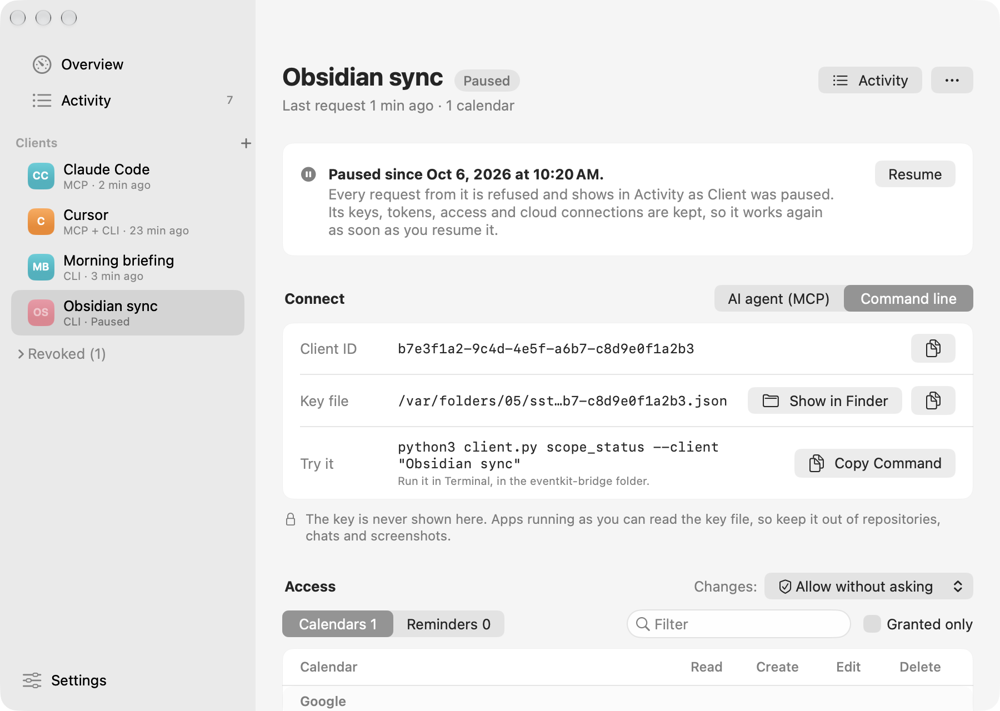

# Using the menu bar app

The app runs in the current macOS user's graphical session. Its menu bar icon, the app icon's day arc, shows EK Bridge's state: the arc when EK Bridge is on, a faded arc with a pause sign when it's paused, and the arc with a dot when something needs attention (macOS access missing for a type a connection uses, connection settings unreadable, EK Bridge failed to start, or the MCP server or Remote Access is on but couldn't start). A small globe next to it means Remote Access is on. The menu starts with a switch for EK Bridge, then **Pause EK Bridge ▸** (**For 1 Hour**, **Until Tomorrow**, which means 8:00 the next morning, or **Until I Turn It On**), or **Turn On EK Bridge** while it's paused. A timed pause turns EK Bridge back on by itself; the menu header, its tooltip and Overview say until when (*EK Bridge is paused until 3:40 PM*), and turning it on or off by hand ends the schedule. Below that come, while it runs, an **MCP** line (**MCP on port 47615**, or why it couldn't start; it opens Settings ▸ Advanced), while Remote Access is on a **Remote Access on · N cloud connections** line and **Turn Off Remote Access**, then **Needs you** (changes waiting for approval, problems with their fix, an available update), **Recent changes** (the last three adds, edits, completions or deletes, with **Show All Activity…**), and **Open EK Bridge…** (⌘O), **Settings…** (⌘,) and **Check for Updates…**. With EK Bridge paused, the menu says **Paused · agents and scripts are refused**.

Everything else is in one window with a sidebar: **Overview**, **Activity**, each **connection**, and **Settings**. Overview's status card also shows the MCP server's state and, while it's on, Remote Access (*Remote Access · Reachable · my-mac.tail1234.ts.net*), and each connection row has an **MCP**, **CLI** or **MCP + CLI** badge. The CLI runs locally on the same Mac; see [API and CLI](API.md). AI agents connect over MCP, and cloud agents through Remote Access; see [MCP](MCP.md). The app calls a grant **access** and a collection a **calendar** or **list**.

## First run

On first launch the window opens on a setup checklist. The steps can be done in any order, and each one updates as soon as it's done:

- **Allow Calendar access** and **Allow Reminders access.** **Allow Access…** shows the macOS prompt. If access was turned off or is add-only, **Open Privacy Settings** goes straight to the right pane. You need only the one your tools use: once the other is done and a connection exists, the step says it's optional and offers **Skip**.
- **Add a connection.** A connection is one agent or script with its own key. Give each one its own connection so you can see and remove it separately.
- **Choose what the connection can use.** Opens the connection's Access table.
- **Turn on EK Bridge.** The choice is kept across launches.
- **Connect your tool.** For a command-line connection, **Copy Command** copies a command that works as pasted: `bridge-client scope_status --client "<name>"` once `bridge-client` runs this copy of the app (installed from Settings ▸ Developer, or linked by Homebrew), else the app's own copy by its full path, such as `/Applications/EKBridge.app/Contents/MacOS/bridge-client scope_status …`. A build without a bundled client falls back to `python3 client.py …`, run in the source checkout. For an agent, open Connect ▸ AI agent, copy the setup, and ask the agent something like "What's on my calendar today?". The step completes when the first request arrives, and the checklist turns into the normal Overview.

**Hide Setup** hides the checklist; **Help ▸ Show Setup Checklist** or Settings ▸ About brings it back.

## Connections and access

Choose **Add a Connection…** (⌘N, the **+** in the sidebar, or Overview). The sheet shows a tile per agent: the ones found on this Mac come first, marked **Installed** (EK Bridge looks for their apps and config folders, such as `Claude.app`, `Cursor.app` and `~/.claude`), then the other common ones, **Script or command line**, and **More agents…**; while Remote Access is on, also **Cloud agent**. An agent tile creates a connection with an MCP token file (what the agent reads is sent to its AI provider); **Script or command line** creates a key file for `bridge-client` (or `client.py`). A connection can get the other credential later from its **⋯** menu.

- **Name** is filled in from the tile ("Claude Code", then "Claude Code 2") and can be changed. It must be unique among active connections; it's shown in Activity and the menu bar.
- **Starting access:** **Read all calendars and lists** (the default for agents), **Read all; add and change in one…** (then pick the calendar or list it may change), or **Nothing yet; I'll choose next** (the default for scripts). It covers the calendars and lists you have now, not ones added later, and only types with Full Access. With more than 99 calendars and lists, the first 99 get Read and a banner says so.
- **Ask me before each change** is preset from Settings (on for agents, off for scripts).

**Add and Connect** saves the connection with that access and opens its Connect tab with the agent already chosen; with **Nothing yet** it opens Access instead. Nothing is granted until you click it. EK Bridge remembers each connection's agent (in its settings, not in the registry).

A connection's page has a header and three tabs. The header shows its name, a **Paused** label while it's paused, one status line (**Connected** with the agent's name as reported and when its last request came, **Waiting for Claude Code** and its starting access before the first request, **Paused since…**, or **Last request was refused:** and why), and the **⋯** menu. The page opens on **Connect** until the connection's first successful request, then on **Access**; ⌘⌥← and ⌘⌥→ switch tabs. The bar with unsaved access changes stays at the bottom on every tab.

- **Connect.** For an agent with one-click setup (Claude Desktop, Cursor, Claude Code), **Add to <Agent>…** ([details](MCP.md#one-click-claude-desktop-cursor-and-claude-code)); for the others, the setup to copy (**Copy Command**, **Copy**, or **Install in VS Code**), its steps, and **Show Config File in Finder** (the file, or its folder until it exists). Below it: **Copy the setup instead**, **Advanced options** (the **Method** choice and the token file) and **Set up a different agent…** (the agent list, with the ones found on this Mac marked). **Token** shows only that a token exists and when it was created, with **Copy Token…** (only for methods that need it) and **Reset…**; **Server** shows the URL and whether it's listening. If EK Bridge is paused, the local MCP server is turned off, or the connection has no token, the tab says so with a button to fix it; if the app isn't in Applications, it says so with **Move to Applications…** ([details](SETUP.md)).
  - A script's connection shows **Command line** instead: the **Client ID** (the `--client` value), the key file path (**Show in Finder** selects the file, never opens it), and a ready-to-run command. Each has a copy button. If the key file is missing, the page says so; **Rotate Key…** writes a new one. A connection with both a token and a key chooses between **AI agent** and **Command line** at the top.
  - Neither the key nor the token is ever shown or put in a tooltip. **Copy Token…** asks first and clears the clipboard after 90 seconds.
  - **From the cloud**, at the bottom: while Remote Access is on, **Allow cloud access** (off by default), and with it on, a **Cloud agent** picker with the URL and setup for that agent, the connected cloud apps with **Revoke**, the last remote use, **Copy Remote Token…**, **Reset Remote Token…**, **Connect a Cloud App…** (opens pairing for 10 minutes) and, for Gemini Enterprise, **Set Up OAuth Client…**. Turning cloud access off asks first and ends the remote token and every connected cloud app; access on this Mac isn't affected. With Remote Access off, one line says so (and links to it). See [Use from cloud agents](MCP.md#use-from-cloud-agents).
- **Activity:** this connection's requests, with the same details as the Activity page.
- **Access:** a table per type (**Calendars** and **Reminders**), grouped by account, with each calendar's color. Calendars offer Read, Create, Edit, Delete; lists add Complete. Read-only calendars show a lock and a dash instead of write boxes. Filter by name or account, or show **Granted only**. Each column header is a menu: **Turn On for All** or **Turn Off for All** sets that action on every row shown (Filter and Granted only apply; write actions also turn on Read, turning Read off also turns off the write actions, and that asks first when it clears more than five boxes). Each row's **⋯** button, and its right-click menu, has **Read Only**, **Full Access**, **No Access** and **Copy Calendar ID**. ⌘Z undoes a whole column at once.
  - Checking a write action also checks **Read**. You can uncheck Read afterwards; the row then warns that the connection can't look up the items it's allowed to change.
  - Edits are staged. A bar at the bottom shows the number of unsaved changes with **Revert** and **Save** (⌘S); ⌘Z undoes the last change. Switching connection or pane, closing the window, turning EK Bridge on or pausing it, or quitting with unsaved changes asks whether to save them.
  - Saved changes apply to the next request; a request already running may need to be sent again.
  - If EventKit doesn't list a calendar a connection has access to (account signed out, Full Access off, calendar deleted), the access is kept and a banner says so. **Review…** lists those IDs; **Remove** stages their removal for the next Save. Write access saved on a calendar that has since become read only is dropped on the next Save, and the row warns about it first.
- **Changes:** next to the Access title, **Ask me first** or **Allow without asking**. See [Ask before changes](#ask-before-changes). It saves immediately and isn't part of the staged edits.
- The **⋯** menu: **Rename…** (or double-click the name in the sidebar); under MCP Access, **Turn On MCP Access** or **Reset MCP Token…**, **Remove MCP Access…** and **Show Token File in Finder**; under Command Line, **Add Command-Line Key** or **Rotate Key…**, **Remove Command-Line Key…** and **Show Key File in Finder**; **Pause Connection** or **Resume Connection**; and **Remove Connection…**. Removing one credential leaves the other and all access in place.

Renaming doesn't change the key, the token, the ID or any access, so running tools keep working. Only commands that use `--client "<old name>"` need the new name. Agent setups use the client ID.

### Pause a connection

**Pause Connection** (in the **⋯** menu or the sidebar's right-click menu) stops one connection without taking anything away. Every request from it, over the command line, MCP or Remote Access, is refused with `client_paused` and shows in Activity as **Connection was paused**. Its key, MCP and remote tokens, connected cloud apps, access and Ask before changes setting are all kept, so agents stay configured and connected. **Resume** (on the connection's page, or **Resume Connection** in either menu) lets its next request through as before; nothing needs to be set up again.

Pausing saves immediately and doesn't ask first, because it's undone by resuming. Changes from the connection waiting for your approval are refused, an **Allow for 15 minutes** window ends, and a request already running is refused at its next check. A paused connection shows **Paused** in the sidebar, on Overview and on its page, and you can still rename it or change its access while it's paused. It still counts toward the limit of 32. Use **Remove Connection…** instead when the tool should never connect again.

<picture>
  <source media="(prefers-color-scheme: dark)" srcset="images/client-paused-dark.png">
  
</picture>

Only active connections count toward the limit of 32. Removed connections stay in the sidebar under **Removed**, read only, so Activity stays understandable; the app keeps up to 200 of them and drops the oldest first.

## Ask before changes

With **Changes: Ask me first**, every create, edit, complete or delete from that connection waits for your answer in a small panel at the top right of the screen. Reads never ask. The panel names the connection, the calendar or list, and what would change (before and after, for an edit); the agent's name is shown as reported.

- **Allow** or **Deny** (for a delete, the default button reads **Delete**; when the item to delete can't be loaded, **Deny** is the default and **Delete Anyway** takes a click). Return and Escape work only after you click into the panel, so typing in the agent's terminal can't answer it.
- **Allow changes from … for 15 minutes** skips the panel for that connection until the time is up or its settings change.
- After **45 seconds** without an answer the change is refused. Up to 3 changes per connection can wait; the panel steps through them ("1 of 3"), and the menu bar's **changes waiting for approval** item brings it forward.
- Removing the connection, changing its access, or pausing EK Bridge refuses whatever is waiting.
- Cloud agents ask the same way. They often run while you're away, so with **Ask me first** their changes are declined unless you answer at this Mac.

Prompts are always your choice. Change them per connection with **Changes:** on its page, set the defaults for new connections in Settings ▸ MCP Server, or use **Apply to All Connections…** there. Connections from before 0.4.0 start as *Allow without asking*. More in [MCP](MCP.md#ask-before-changes).

## Activity

**Activity** lists recent requests, newest first (the registry keeps its last 500 rows; each request has a start row and a result row, so that's about 250 requests): time, how it came in, connection, request, calendar or list, and result. The narrow **Via** column shows a sparkle for MCP, a cloud for Remote Access and a terminal for the command line (rows from before 0.4.0 have none). Filter by connection (**All Connections**, one connection, or **Unknown connection**) and by **Via** (All, MCP, Remote Access, Command line) from the same menu, show only **Problems**, or search by connection, request, result, code, calendar name or agent name. Select a row for the details: the exact code, why it happened, what to do, and a button that goes to the fix (for example **Open Claude Code ▸ Groceries** for a request that wasn't allowed). For MCP rows the details add **Via** (*MCP (Claude Code 2.4.1, as reported)*), and for changes that needed approval, **Approval** (*You approved*, *You declined*, *No answer in 45 s*, or *Allowed by a 15-minute allowance*). Remote rows show **Via** *MCP · remote*, with the agent and the tunnel when known, and **From**, the caller's address as the tunnel reported it. The address and tunnel are kept in memory for the last 50 remote requests and never saved, so older rows and rows from before a restart don't show them. The sidebar and the menu header count problems you haven't seen yet.

Requests refused because EK Bridge was paused (**EK Bridge was paused**) or because a connection sent too many (**Too many requests**) are recorded too, so you can see that something tried. Failed MCP sign-ins appear as unauthorized rows with no connection, at most one every 10 seconds for the MCP port and one for Remote Access.

Activity stores the time, client ID, command, result, the target calendar or list **ID**, how the request came in (`cli`, `mcp` or `remote`), the agent's reported name, and the approval answer. It never stores titles, parameters, item content, keys or tokens; calendar names are looked up when shown. Separately, the names, accounts and colours of calendars and lists that a connection has access to are kept in `collection-labels.json`, so EK Bridge can name one that becomes unavailable ("Project calendar (Exchange) · Not available since Oct 5"). A label goes when no connection has access to its calendar or list any more.

## Settings

- **Start at login** uses macOS Login Items. It's available when the app is in `/Applications` or `~/Applications`, and says what to do if macOS needs your approval. EK Bridge also remembers whether it was on.
- **Show in Dock:** *While the window is open* (default), *Always*, or *Never*. The menu bar icon is always shown.
- **Check for updates automatically** (on by default) asks GitHub once a day whether a newer version exists, sending only your IP address and the app's version; **Check for Updates…** (also in the app and menu bar menus) checks now. A found update shows as **Update Available** in the menu bar menu and a card on Overview; the update window shows what's new and installs only when you click. The app waits for changes in the approval panel to be answered, then restarts. A copy built from source can't update itself.
- **Local MCP server:** the switch (on by default; the server runs while EK Bridge is on and a connection has MCP access), its status and URL, the **Port** (**Change…**), the **Launcher** path agents run (**Copy Path**, **Show in Finder**, and a warning if the app isn't in Applications), and how many agent requests arrived today. If the port is in use, **Try Again** and **Choose Another Port…** appear. Turning the server off when an agent used it in the last 10 minutes asks first.
- **Remote Access:** the **Remote Access** switch (off by default; turning it on asks first), **Status** with **Test**, the **Tunnel** guide with commands to copy, the tunnel's **Address**, the **MCP URL** with **Reset Path…**, the **Port** (47616 by default, **Change…**), **Turn off automatically** (Never, after 1 hour, 8 hours or 1 day) and **Keep this Mac awake while on power**. See [Use from cloud agents](MCP.md#use-from-cloud-agents).
- **Ask before changes:** the default for **New AI agent connections** (*Ask me first*) and **New command-line connections** (*Allow without asking*), and **Apply to All Connections…**, which sets every connection to one mode after a confirmation.
- **Developer:** **Install Command-Line Tool** links the app's `bridge-client` into `~/.local/bin` (no administrator password; add that folder to your `PATH` if your shell can't find it), and once installed the app's copied commands use `bridge-client`. **Show developer tools** (off by default) shows the app's test calendar and list tools, every calendar and list ID EventKit can see, MCP traffic counts since launch, both ports together (requests, errors by status, failed authentications; never contents), and the data folder.
- **About:** the version, **Show Setup Checklist**, and links to the help pages, release notes, Discussions and the issue tracker (also in the **Help** menu: **EK Bridge Help**, **Set Up an AI Agent**, **Release Notes**, **Ask a Question…**, **Report an Issue…**).

## Keyboard shortcuts

**⌘1** Overview, **⌘2** Activity, **⌘3** Settings (**⌘,** works too), **⌘⌥←** and **⌘⌥→** a connection's previous and next tab, **⌘F** Activity's search, **⌘N** adds a connection, **⌘S** and **Revert Access** for access edits, **⌘O** opens the window.

## Local key and token files

The app writes each connection's key file, MCP token file and, for a connection with cloud access, remote token file to the following paths, using the lower-case client UUID shown on its page (its **Client ID**):

```text
~/Library/Application Support/EKBridge/client-credentials/<client UUID>.json
~/Library/Application Support/EKBridge/client-credentials/<client UUID>.mcp-token
~/Library/Application Support/EKBridge/client-credentials/<client UUID>.mcp-remote-token
```

The directory is mode 0700 and the files are mode 0600. The key file contains the client UUID and an `ekb_v1_` signing seed; the token file contains only the `ekb_mcp_v1_` token, and the remote token file only the `ekb_mcpr_v1_` token. Connected cloud apps are kept in `remote-connections.json` in the same data folder, as hashes only. The app stores only the matching public verifier and token hash, client names, access, revision, Ask before changes setting, and bounded activity history in `client-registry.json`. Agents use the token file through the launcher or their own config; don't paste the token anywhere else. Pass the client's name or ID (`--client`) or the **file path** (`--credentials-file`) to `client.py`; never paste the seed into a command, chat, issue, screenshot, or repository. Anyone with the file and access to this macOS user account can sign requests within its current access.

- **Rotate Key…** replaces the key file and verifier for the connection. The old key stops working for future requests. Update any task that points to a moved or copied key file; the app can't remove copies it doesn't know about.
- **Reset MCP Token…** replaces the token. Launcher and token-file setups keep working; agents you gave the token to directly need the new one. **Remove MCP Access…** deletes it.
- **Copy Remote Token…** creates the remote token the first time, asks first, and clears the clipboard after 90 seconds; **Reset Remote Token…** replaces it. Turning off **Allow cloud access** deletes it and disconnects the connection's cloud apps.
- **Pause Connection** refuses the connection's requests without changing its credentials or access; **Resume** undoes it. See [Pause a connection](#pause-a-connection).
- **Remove Connection…** invalidates the connection's verifier and tokens, disconnects its cloud apps and removes its files. If the file can't be removed, a banner says so with **Show in Finder**. Future requests and asynchronous replies that recheck the connection's revision are denied; removing it can't undo a write that EventKit already committed.
- Pausing EK Bridge stops all requests from agents and scripts without changing access, and is saved. The local MCP server stops with it (agents see that EK Bridge is paused); Remote Access keeps listening but refuses tool calls. **Quit** stops the running process, the MCP server and Remote Access.

An agent or script using a saved grant still needs authorization for the **particular user task** it is performing. The grant configures what EK Bridge permits; it does not create standing permission to make unrelated Calendar or Reminders changes.

## A safe first CLI check

After adding a connection and turning on EK Bridge, start with metadata and a bounded read from an empty temporary collection you own. Use the connection's name shown in the app, and the collection ID shown in the UI; do not inspect the credential contents. The examples use `python3 client.py` from a source checkout; with the command-line tool installed, write `bridge-client` instead:

```sh
python3 client.py scope_status --client "<client name>"
```

`--client` also accepts the client UUID. Clients can be renamed, so a script meant to last should use the UUID or the explicit key file path:

```sh
python3 client.py scope_status \
  --credentials-file "$HOME/Library/Application Support/EKBridge/client-credentials/<client UUID>.json"
```

`scope_status` returns the client's saved grants. `authorization_status` returns macOS Calendar and Reminders access. To read at most one reminder from a granted test list, pass the parameters on stdin so they need no temporary file:

```sh
echo '{"listID":"<ID of your temporary test list>","limit":1}' |
  python3 client.py read_reminders --client "<client name>" --params-file -
```

`python3 client.py --help` lists every command and the access it needs; `python3 client.py read_reminders --help` lists its parameters. Errors go to stderr with a short fix, and the exit code says what kind of problem it was (see [API and CLI](API.md)).

The client prints its response to the terminal; use only a terminal and log destination appropriate for the data. EK Bridge will return `forbidden` if the list has no Read grant. A safe synthetic **write** recipe and the complete parameter reference are in [API and CLI](API.md#synthetic-example).
